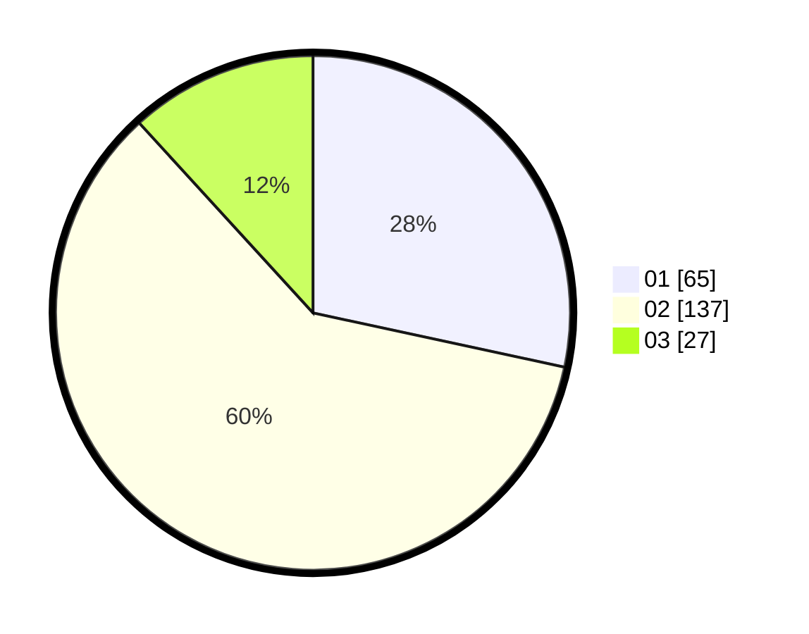

# Hasil

Hasil perolehan suara paslon dapat dilihat pada file paslon-01.txt, paslon-02.txt, dan paslon-03.txt.

Jika tidak ada, artinya data tersebut belum ada pada SIREKAP.

## Perolehan Suara

 * Paslon 01: **65**.
 * Paslon 02: **137**.
 * Paslon 03: **27**.

## Foto C Plano

https://sirekap-obj-formc.kpu.go.id/722c/pemilu/ppwp/31/73/06/10/03/3173061003051-20240215-204742--ea9fbf50-c560-4e3b-b6f2-90b82c1738cd.jpg

https://sirekap-obj-formc.kpu.go.id/722c/pemilu/ppwp/31/73/06/10/03/3173061003051-20240215-204744--7c1494a5-9e6b-4471-a347-15a1c11a30f2.jpg

https://sirekap-obj-formc.kpu.go.id/722c/pemilu/ppwp/31/73/06/10/03/3173061003051-20240215-204743--07c04c44-3a6f-467d-b483-bdb70095a01c.jpg

## DATA PEMILIH TETAP

Jumlah pemilih dalam DPT: **293**.
 * L: **160**.
 * P: **133**.

## DATA PENGGUNA HAK PILIH

Jumlah pengguna hak pilih dalam DPT: **216**.
 * L: **114**.
 * P: **102**.

Jumlah pengguna hak pilih dalam DPTb: **0**.
 * L: **0**.
 * P: **1**.

Jumlah pengguna hak pilih dalam DPK: **12**.
 * L: **8**.
 * P: **4**.

Jumlah pengguna hak pilih: **229**.
 * L: **122**.
 * P: **107**.

## JUMLAH SUARA SAH DAN TIDAK SAH

JUMLAH SELURUH SUARA SAH: **229**.

JUMLAH SUARA TIDAK SAH: **0**.

JUMLAH SELURUH SUARA SAH DAN SUARA TIDAK SAH: **229**.
