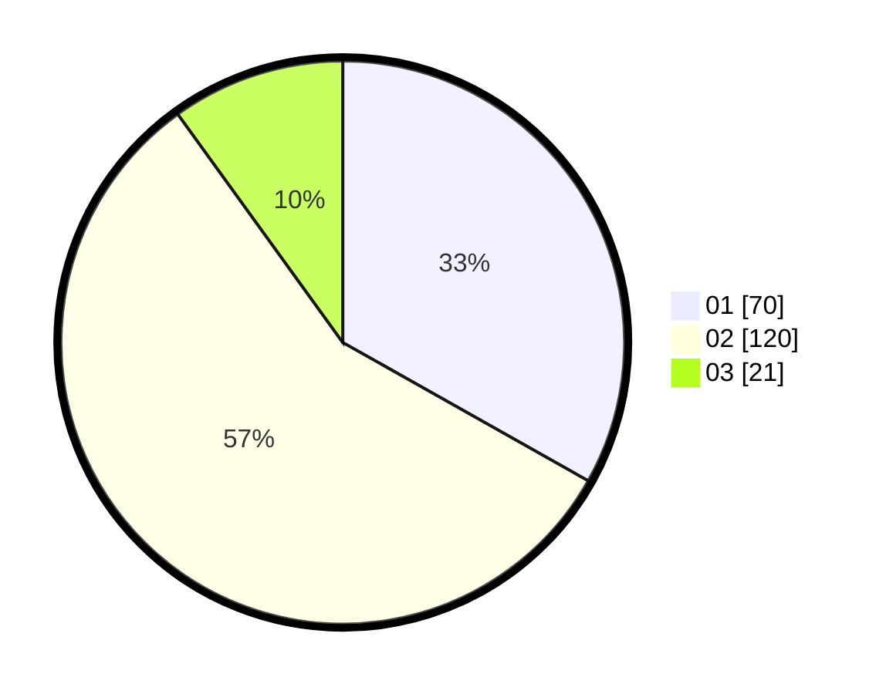

# Hasil

Hasil perolehan suara paslon dapat dilihat pada file paslon-01.txt, paslon-02.txt, dan paslon-03.txt.

Jika tidak ada, artinya data tersebut belum ada pada SIREKAP.

## Perolehan Suara

 * Paslon 01: **70**.
 * Paslon 02: **120**.
 * Paslon 03: **21**.

## Foto C Plano

https://sirekap-obj-formc.kpu.go.id/df82/pemilu/ppwp/31/73/06/10/03/3173061003053-20240214-185852--1fc2f146-231e-4ce9-b248-59704e705fbf.jpg

https://sirekap-obj-formc.kpu.go.id/df82/pemilu/ppwp/31/73/06/10/03/3173061003053-20240214-192341--8b9c5c12-8f3b-4a56-a3e1-47257f2470ae.jpg

https://sirekap-obj-formc.kpu.go.id/df82/pemilu/ppwp/31/73/06/10/03/3173061003053-20240214-185944--f8c773b3-ee8b-45a9-9196-7cbe57d09f0a.jpg

## DATA PEMILIH TETAP

Jumlah pemilih dalam DPT: **296**.
 * L: **125**.
 * P: **171**.

## DATA PENGGUNA HAK PILIH

Jumlah pengguna hak pilih dalam DPT: **217**.
 * L: **102**.
 * P: **115**.

Jumlah pengguna hak pilih dalam DPTb: **0**.
 * L: **0**.
 * P: **0**.

Jumlah pengguna hak pilih dalam DPK: **0**.
 * L: **0**.
 * P: **0**.

Jumlah pengguna hak pilih: **217**.
 * L: **102**.
 * P: **115**.

## JUMLAH SUARA SAH DAN TIDAK SAH

JUMLAH SELURUH SUARA SAH: **217**.

JUMLAH SUARA TIDAK SAH: **85**.

JUMLAH SELURUH SUARA SAH DAN SUARA TIDAK SAH: **302**.
