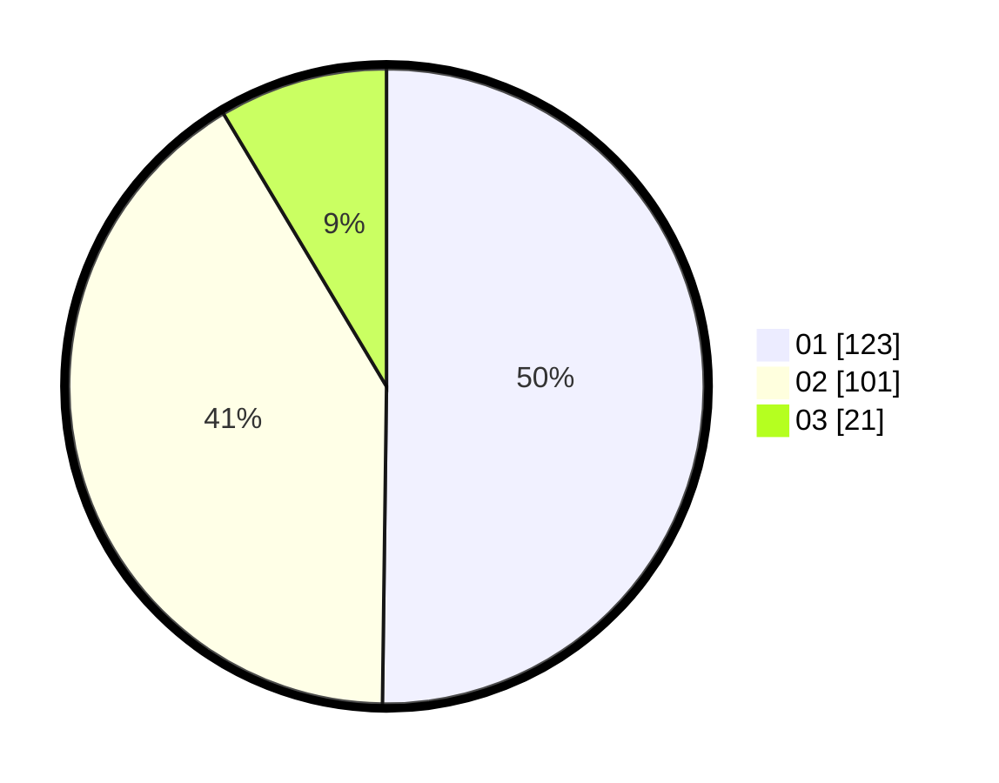

# Hasil

Hasil perolehan suara paslon dapat dilihat pada file paslon-01.txt, paslon-02.txt, dan paslon-03.txt.

Jika tidak ada, artinya data tersebut belum ada pada SIREKAP.

## Perolehan Suara

 * Paslon 01: **123**.
 * Paslon 02: **101**.
 * Paslon 03: **21**.

## Foto C Plano

https://sirekap-obj-formc.kpu.go.id/e59b/pemilu/ppwp/31/73/06/10/03/3173061003061-20240215-004313--240d9190-1679-46ad-87b9-9806e0e3b574.jpg

https://sirekap-obj-formc.kpu.go.id/e59b/pemilu/ppwp/31/73/06/10/03/3173061003061-20240215-004401--bba01479-e8de-451d-85fc-d4ee4d42924a.jpg

https://sirekap-obj-formc.kpu.go.id/e59b/pemilu/ppwp/31/73/06/10/03/3173061003061-20240215-004429--644c27fa-2938-4e9e-b663-46f9efb0afea.jpg
