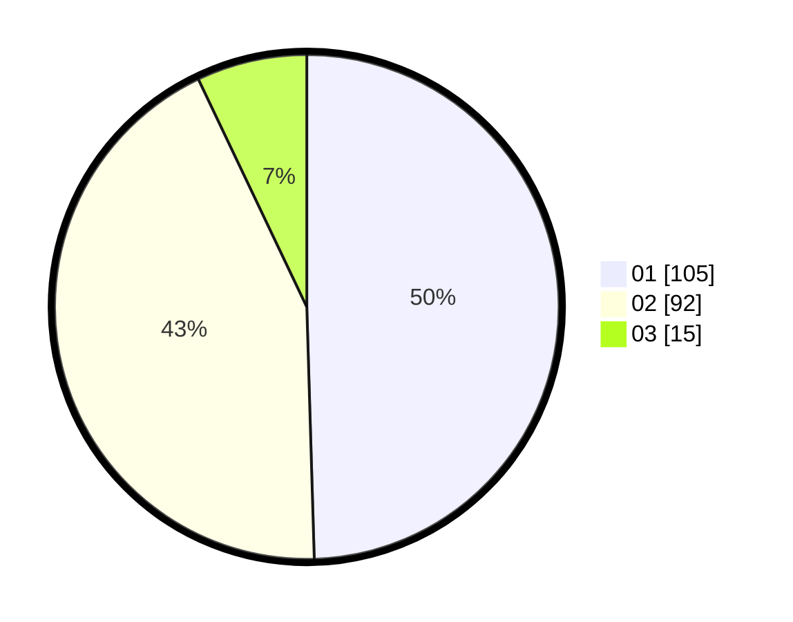

# Hasil

Hasil perolehan suara paslon dapat dilihat pada file paslon-01.txt, paslon-02.txt, dan paslon-03.txt.

Jika tidak ada, artinya data tersebut belum ada pada SIREKAP.

## Perolehan Suara

 * Paslon 01: **105**.
 * Paslon 02: **92**.
 * Paslon 03: **15**.

## Foto C Plano

https://sirekap-obj-formc.kpu.go.id/f9fd/pemilu/ppwp/31/73/06/10/03/3173061003062-20240214-220330--6c2a08f7-6b4f-4c78-8b99-2554e74ddf50.jpg

https://sirekap-obj-formc.kpu.go.id/f9fd/pemilu/ppwp/31/73/06/10/03/3173061003062-20240214-220438--11bd7e51-529e-4be1-89f5-e11d422db30e.jpg

https://sirekap-obj-formc.kpu.go.id/f9fd/pemilu/ppwp/31/73/06/10/03/3173061003062-20240214-220604--d8365ab1-7e17-49d6-8d4f-2fdec5250059.jpg
