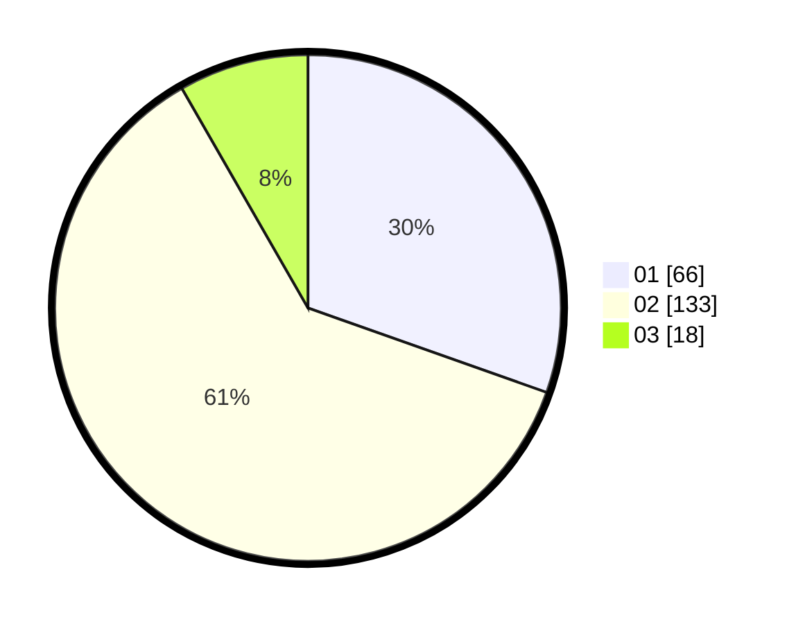

# Hasil

Hasil perolehan suara paslon dapat dilihat pada file paslon-01.txt, paslon-02.txt, dan paslon-03.txt.

Jika tidak ada, artinya data tersebut belum ada pada SIREKAP.

## Perolehan Suara

 * Paslon 01: **66**.
 * Paslon 02: **133**.
 * Paslon 03: **18**.

## Foto C Plano

https://sirekap-obj-formc.kpu.go.id/d1b8/pemilu/ppwp/31/73/06/10/03/3173061003063-20240214-205154--42ef6430-4982-49fc-a69f-e5597d7249c9.jpg

https://sirekap-obj-formc.kpu.go.id/d1b8/pemilu/ppwp/31/73/06/10/03/3173061003063-20240214-205232--f17681df-5006-4433-8bad-9f4003d04d82.jpg

https://sirekap-obj-formc.kpu.go.id/d1b8/pemilu/ppwp/31/73/06/10/03/3173061003063-20240214-205636--0eecdeed-8363-4f24-9052-84293bd34b5c.jpg
