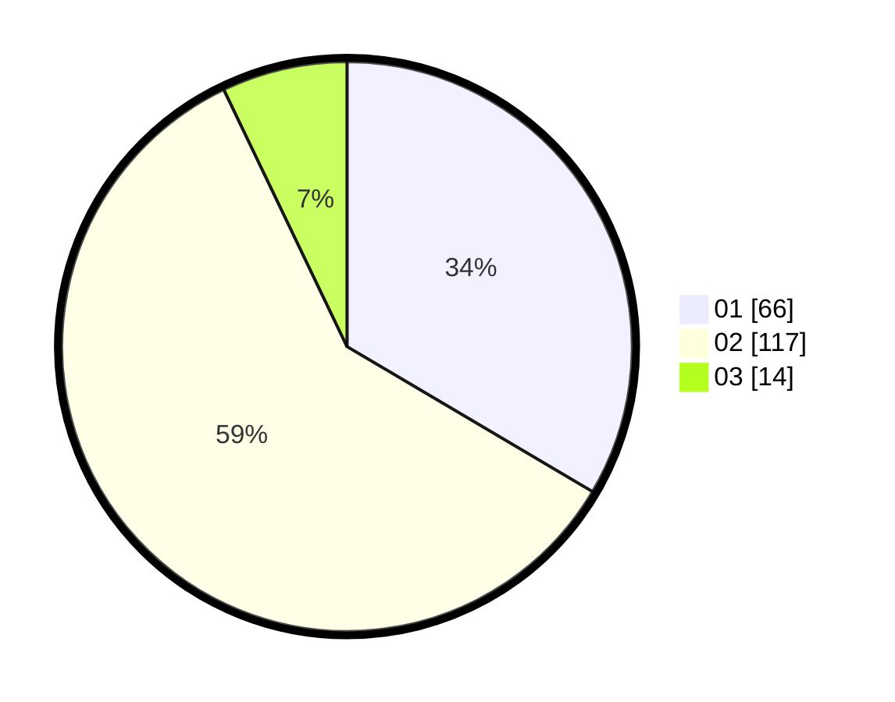

# Hasil

Hasil perolehan suara paslon dapat dilihat pada file paslon-01.txt, paslon-02.txt, dan paslon-03.txt.

Jika tidak ada, artinya data tersebut belum ada pada SIREKAP.

## Perolehan Suara

 * Paslon 01: **66**.
 * Paslon 02: **117**.
 * Paslon 03: **14**.

## Foto C Plano

https://sirekap-obj-formc.kpu.go.id/c8e5/pemilu/ppwp/31/73/06/10/03/3173061003066-20240214-230608--df6c5618-37ae-4275-a6c1-5fa552412aa9.jpg

https://sirekap-obj-formc.kpu.go.id/c8e5/pemilu/ppwp/31/73/06/10/03/3173061003066-20240214-230612--cf0b0d15-82c0-4bc8-846d-0e54fc1c5e53.jpg
