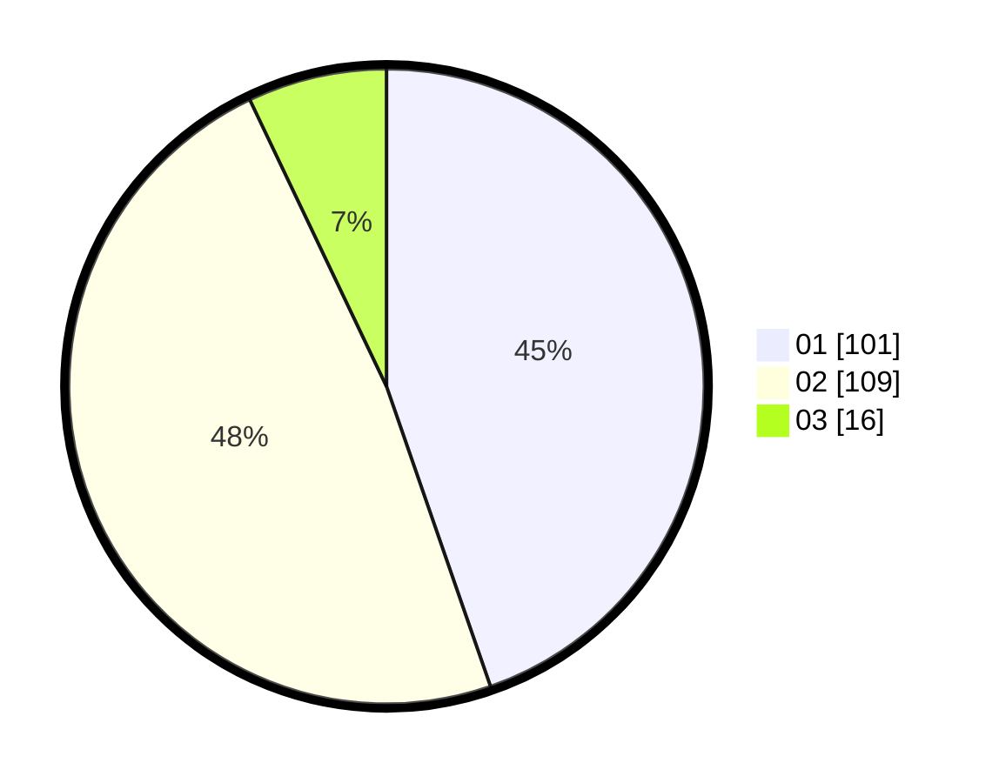

# Hasil

Hasil perolehan suara paslon dapat dilihat pada file paslon-01.txt, paslon-02.txt, dan paslon-03.txt.

Jika tidak ada, artinya data tersebut belum ada pada SIREKAP.

## Perolehan Suara

 * Paslon 01: **101**.
 * Paslon 02: **109**.
 * Paslon 03: **16**.

## Foto C Plano

https://sirekap-obj-formc.kpu.go.id/0365/pemilu/ppwp/31/73/06/10/03/3173061003067-20240216-045605--61165af8-ee12-48a2-a727-9fbe206b5520.jpg

https://sirekap-obj-formc.kpu.go.id/0365/pemilu/ppwp/31/73/06/10/03/3173061003067-20240216-045607--20547040-288d-4501-b6da-c0387d9eab6d.jpg

https://sirekap-obj-formc.kpu.go.id/0365/pemilu/ppwp/31/73/06/10/03/3173061003067-20240216-045606--adf72120-a189-4e51-8664-35643ef03890.jpg

## DATA PEMILIH TETAP

Jumlah pemilih dalam DPT: **267**.
 * L: **131**.
 * P: **136**.

## DATA PENGGUNA HAK PILIH

Jumlah pengguna hak pilih dalam DPT: **228**.
 * L: **109**.
 * P: **119**.

Jumlah pengguna hak pilih dalam DPTb: **0**.
 * L: **0**.
 * P: **0**.

Jumlah pengguna hak pilih dalam DPK: **3**.
 * L: **1**.
 * P: **2**.

Jumlah pengguna hak pilih: **231**.
 * L: **110**.
 * P: **121**.

## JUMLAH SUARA SAH DAN TIDAK SAH

JUMLAH SELURUH SUARA SAH: **226**.

JUMLAH SUARA TIDAK SAH: **5**.

JUMLAH SELURUH SUARA SAH DAN SUARA TIDAK SAH: **231**.
