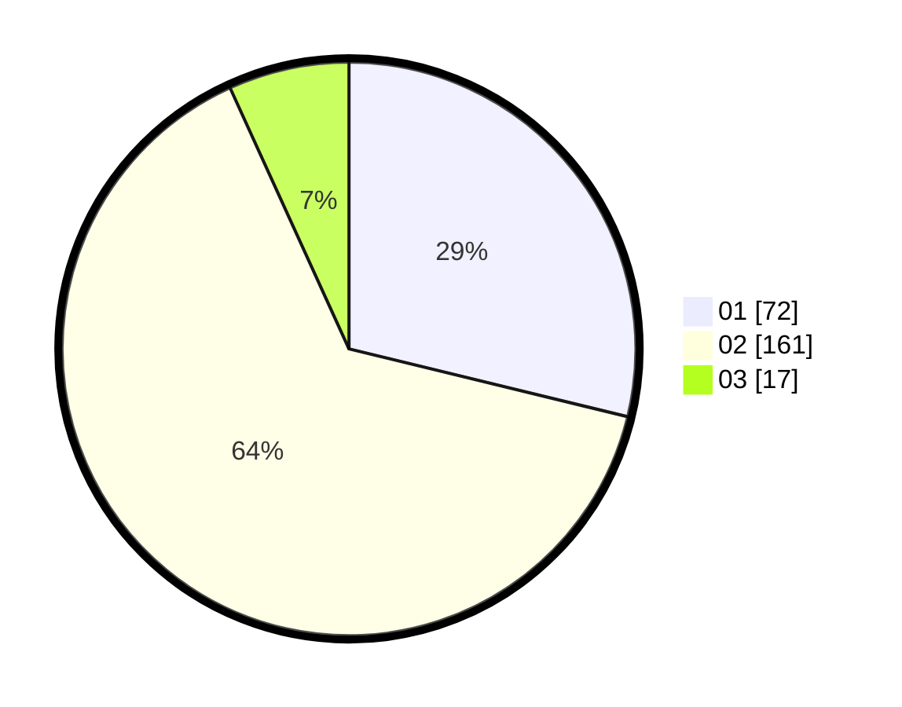

# Hasil

Hasil perolehan suara paslon dapat dilihat pada file paslon-01.txt, paslon-02.txt, dan paslon-03.txt.

Jika tidak ada, artinya data tersebut belum ada pada SIREKAP.

## Perolehan Suara

 * Paslon 01: **72**.
 * Paslon 02: **161**.
 * Paslon 03: **17**.

## Foto C Plano

https://sirekap-obj-formc.kpu.go.id/c79c/pemilu/ppwp/31/73/06/10/03/3173061003072-20240216-021349--856fd55b-a58c-421f-8490-543a50688a99.jpg

https://sirekap-obj-formc.kpu.go.id/c79c/pemilu/ppwp/31/73/06/10/03/3173061003072-20240216-020938--e3a26832-2f68-4dad-847c-2904708832ac.jpg

https://sirekap-obj-formc.kpu.go.id/c79c/pemilu/ppwp/31/73/06/10/03/3173061003072-20240216-022314--98b21936-15d0-4bf1-89d0-7153ef56f3e0.jpg

## DATA PEMILIH TETAP

Jumlah pemilih dalam DPT: **289**.
 * L: **154**.
 * P: **135**.

## DATA PENGGUNA HAK PILIH

Jumlah pengguna hak pilih dalam DPT: **255**.
 * L: **134**.
 * P: **121**.

Jumlah pengguna hak pilih dalam DPTb: **0**.
 * L: **0**.
 * P: **0**.

Jumlah pengguna hak pilih dalam DPK: **1**.
 * L: **0**.
 * P: **1**.

Jumlah pengguna hak pilih: **256**.
 * L: **134**.
 * P: **122**.

## JUMLAH SUARA SAH DAN TIDAK SAH

JUMLAH SELURUH SUARA SAH: **250**.

JUMLAH SUARA TIDAK SAH: **6**.

JUMLAH SELURUH SUARA SAH DAN SUARA TIDAK SAH: **256**.
