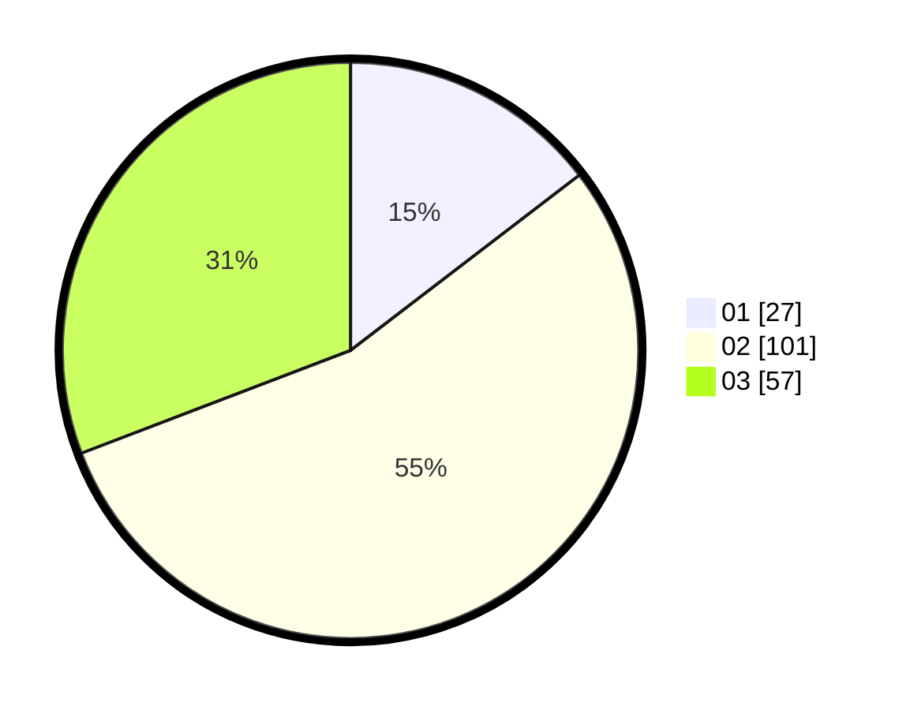

# Hasil

Hasil perolehan suara paslon dapat dilihat pada file paslon-01.txt, paslon-02.txt, dan paslon-03.txt.

Jika tidak ada, artinya data tersebut belum ada pada SIREKAP.

## Perolehan Suara

 * Paslon 01: **27**.
 * Paslon 02: **101**.
 * Paslon 03: **57**.

## Foto C Plano

https://sirekap-obj-formc.kpu.go.id/6ead/pemilu/ppwp/31/73/06/10/03/3173061003083-20240214-213642--90469282-5353-404a-a857-30ad3300c3f2.jpg

https://sirekap-obj-formc.kpu.go.id/6ead/pemilu/ppwp/31/73/06/10/03/3173061003083-20240214-213810--e0a0572a-a43d-48aa-877c-dca48d02e1a6.jpg

https://sirekap-obj-formc.kpu.go.id/6ead/pemilu/ppwp/31/73/06/10/03/3173061003083-20240214-213826--a351163b-ef89-429d-8e21-67b2c8267ffe.jpg
