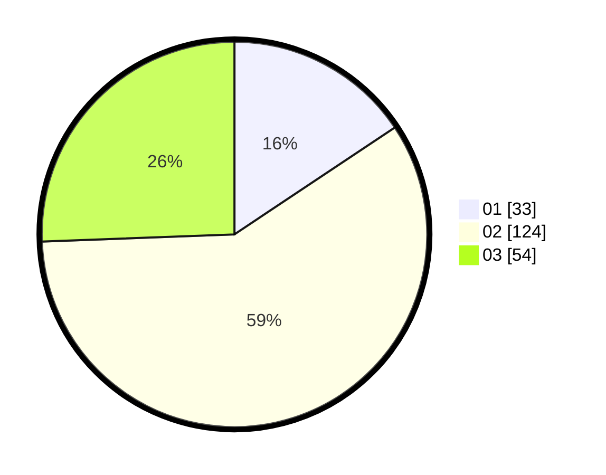

# Hasil

Hasil perolehan suara paslon dapat dilihat pada file paslon-01.txt, paslon-02.txt, dan paslon-03.txt.

Jika tidak ada, artinya data tersebut belum ada pada SIREKAP.

## Perolehan Suara

 * Paslon 01: **33**.
 * Paslon 02: **124**.
 * Paslon 03: **54**.

## Foto C Plano

https://sirekap-obj-formc.kpu.go.id/7fc0/pemilu/ppwp/31/73/06/10/03/3173061003085-20240216-014034--1180c0d4-aa37-4c56-bc05-c1038e139f32.jpg

https://sirekap-obj-formc.kpu.go.id/7fc0/pemilu/ppwp/31/73/06/10/03/3173061003085-20240216-015209--53488f39-69db-416c-94d7-cb5c4af0589f.jpg

https://sirekap-obj-formc.kpu.go.id/7fc0/pemilu/ppwp/31/73/06/10/03/3173061003085-20240216-015205--454999b8-f33c-4a84-a6b2-f4fd59c931e8.jpg

## DATA PEMILIH TETAP

Jumlah pemilih dalam DPT: **296**.
 * L: **145**.
 * P: **151**.

## DATA PENGGUNA HAK PILIH

Jumlah pengguna hak pilih dalam DPT: **210**.
 * L: **96**.
 * P: **114**.

Jumlah pengguna hak pilih dalam DPTb: **0**.
 * L: **0**.
 * P: **0**.

Jumlah pengguna hak pilih dalam DPK: **4**.
 * L: **4**.
 * P: **0**.

Jumlah pengguna hak pilih: **214**.
 * L: **100**.
 * P: **114**.

## JUMLAH SUARA SAH DAN TIDAK SAH

JUMLAH SELURUH SUARA SAH: **211**.

JUMLAH SUARA TIDAK SAH: **3**.

JUMLAH SELURUH SUARA SAH DAN SUARA TIDAK SAH: **214**.
