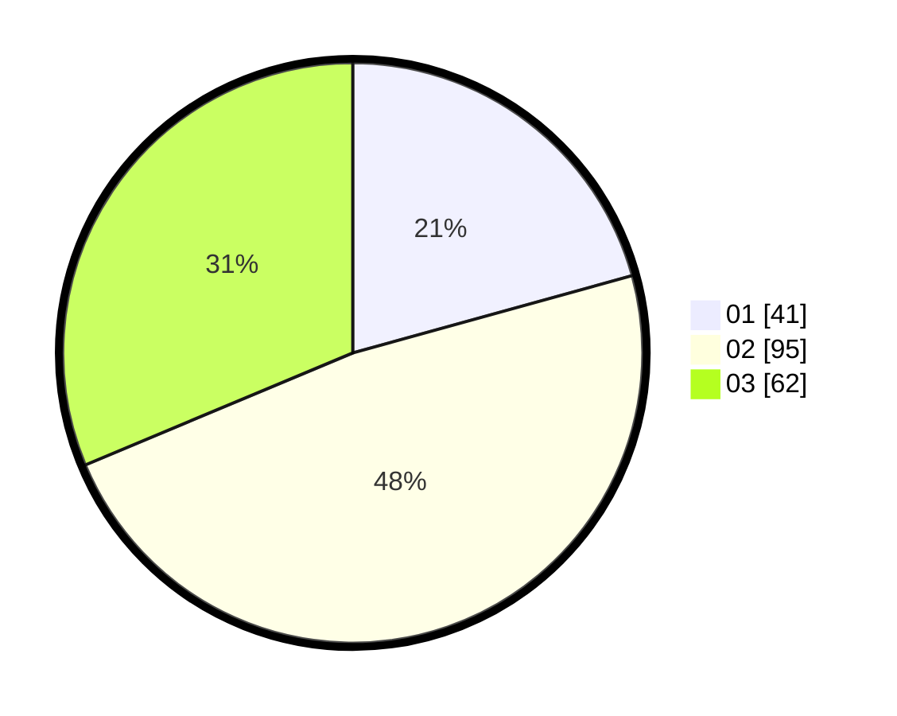

# Hasil

Hasil perolehan suara paslon dapat dilihat pada file paslon-01.txt, paslon-02.txt, dan paslon-03.txt.

Jika tidak ada, artinya data tersebut belum ada pada SIREKAP.

## Perolehan Suara

 * Paslon 01: **41**.
 * Paslon 02: **95**.
 * Paslon 03: **62**.

## Foto C Plano

https://sirekap-obj-formc.kpu.go.id/a074/pemilu/ppwp/31/73/06/10/03/3173061003088-20240214-235124--e4984245-7aff-4234-aa29-30d5dcdf2007.jpg

https://sirekap-obj-formc.kpu.go.id/a074/pemilu/ppwp/31/73/06/10/03/3173061003088-20240214-235445--210e77a5-bd03-4587-944a-67370c005655.jpg

https://sirekap-obj-formc.kpu.go.id/a074/pemilu/ppwp/31/73/06/10/03/3173061003088-20240214-235616--cd50154f-9954-49b5-8c31-0d019758a67f.jpg
