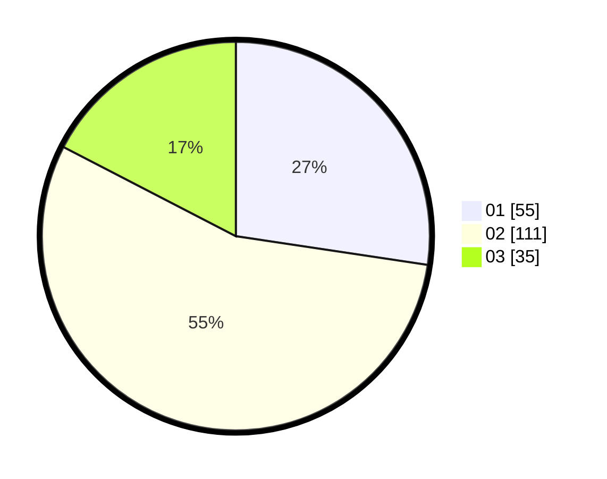

# Hasil

Hasil perolehan suara paslon dapat dilihat pada file paslon-01.txt, paslon-02.txt, dan paslon-03.txt.

Jika tidak ada, artinya data tersebut belum ada pada SIREKAP.

## Perolehan Suara

 * Paslon 01: **55**.
 * Paslon 02: **111**.
 * Paslon 03: **35**.

## Foto C Plano

https://sirekap-obj-formc.kpu.go.id/a517/pemilu/ppwp/31/73/06/10/03/3173061003092-20240214-200613--ff09d0b0-d570-442a-a739-53676d46da1d.jpg

https://sirekap-obj-formc.kpu.go.id/a517/pemilu/ppwp/31/73/06/10/03/3173061003092-20240214-200733--c5dd6c53-2b30-475e-8058-6d84742189c7.jpg

https://sirekap-obj-formc.kpu.go.id/a517/pemilu/ppwp/31/73/06/10/03/3173061003092-20240214-200810--17b5bc23-6134-4832-9589-759412aa8788.jpg

## DATA PEMILIH TETAP

Jumlah pemilih dalam DPT: **270**.
 * L: **145**.
 * P: **125**.

## DATA PENGGUNA HAK PILIH

Jumlah pengguna hak pilih dalam DPT: **198**.
 * L: **97**.
 * P: **101**.

Jumlah pengguna hak pilih dalam DPTb: **0**.
 * L: **0**.
 * P: **0**.

Jumlah pengguna hak pilih dalam DPK: **5**.
 * L: **2**.
 * P: **3**.

Jumlah pengguna hak pilih: **203**.
 * L: **99**.
 * P: **104**.

## JUMLAH SUARA SAH DAN TIDAK SAH

JUMLAH SELURUH SUARA SAH: **201**.

JUMLAH SUARA TIDAK SAH: **4**.

JUMLAH SELURUH SUARA SAH DAN SUARA TIDAK SAH: **205**.
