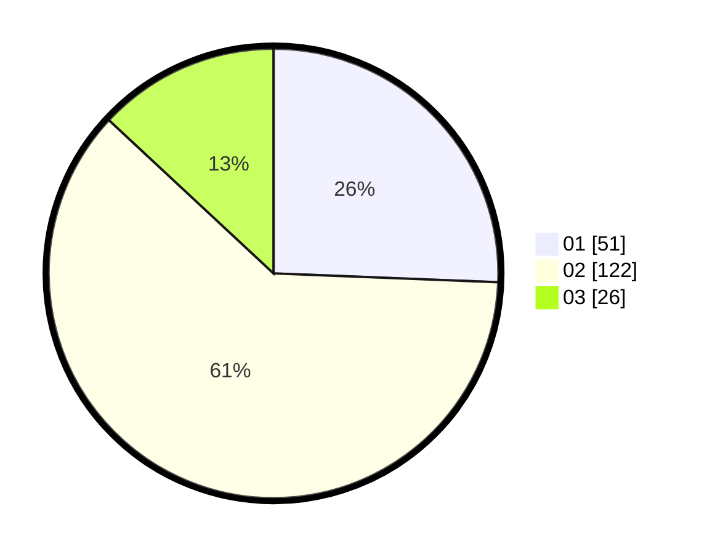

# Hasil

Hasil perolehan suara paslon dapat dilihat pada file paslon-01.txt, paslon-02.txt, dan paslon-03.txt.

Jika tidak ada, artinya data tersebut belum ada pada SIREKAP.

## Perolehan Suara

 * Paslon 01: **51**.
 * Paslon 02: **122**.
 * Paslon 03: **26**.

## Foto C Plano

https://sirekap-obj-formc.kpu.go.id/c7cc/pemilu/ppwp/31/73/06/10/03/3173061003093-20240214-234443--cb86375c-0bdf-4acf-b35a-8a4c7f6ab57f.jpg

https://sirekap-obj-formc.kpu.go.id/c7cc/pemilu/ppwp/31/73/06/10/03/3173061003093-20240214-230231--a6027027-fcd3-4419-898b-05dce6bc93b8.jpg

https://sirekap-obj-formc.kpu.go.id/c7cc/pemilu/ppwp/31/73/06/10/03/3173061003093-20240215-003141--2bc2f6bd-efd6-4aba-8772-794620733def.jpg
