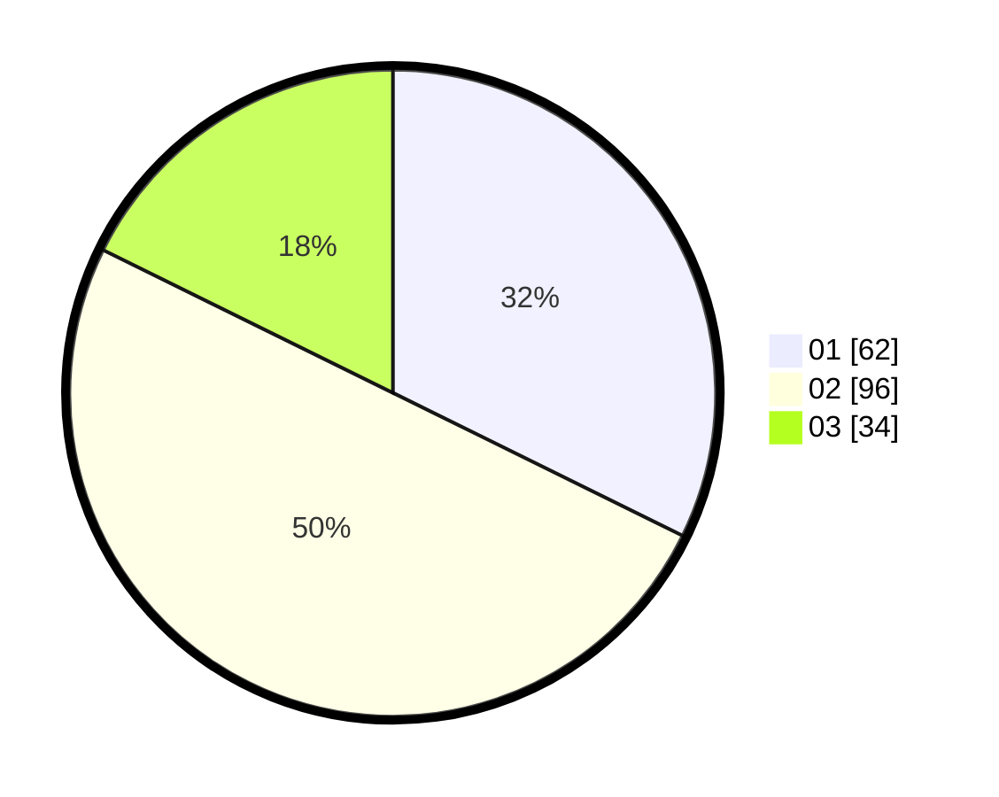

# Hasil

Hasil perolehan suara paslon dapat dilihat pada file paslon-01.txt, paslon-02.txt, dan paslon-03.txt.

Jika tidak ada, artinya data tersebut belum ada pada SIREKAP.

## Perolehan Suara

 * Paslon 01: **62**.
 * Paslon 02: **96**.
 * Paslon 03: **34**.

## Foto C Plano

https://sirekap-obj-formc.kpu.go.id/b46f/pemilu/ppwp/31/73/06/10/03/3173061003097-20240216-005458--f2ecdfab-b371-4271-bcd1-20ca96ad6bca.jpg

https://sirekap-obj-formc.kpu.go.id/b46f/pemilu/ppwp/31/73/06/10/03/3173061003097-20240216-005513--d158b6fc-57bc-4b8f-9346-9db8f6443478.jpg

https://sirekap-obj-formc.kpu.go.id/b46f/pemilu/ppwp/31/73/06/10/03/3173061003097-20240216-010045--f633bbcb-db81-4b05-8973-39647d79f2c5.jpg

## DATA PEMILIH TETAP

Jumlah pemilih dalam DPT: **195**.
 * L: **104**.
 * P: **91**.

## DATA PENGGUNA HAK PILIH

Jumlah pengguna hak pilih dalam DPT: **195**.
 * L: **104**.
 * P: **91**.

Jumlah pengguna hak pilih dalam DPTb: **1**.
 * L: **0**.
 * P: **1**.

Jumlah pengguna hak pilih dalam DPK: **0**.
 * L: **0**.
 * P: **0**.

Jumlah pengguna hak pilih: **196**.
 * L: **104**.
 * P: **92**.

## JUMLAH SUARA SAH DAN TIDAK SAH

JUMLAH SELURUH SUARA SAH: **192**.

JUMLAH SUARA TIDAK SAH: **6**.

JUMLAH SELURUH SUARA SAH DAN SUARA TIDAK SAH: **198**.
