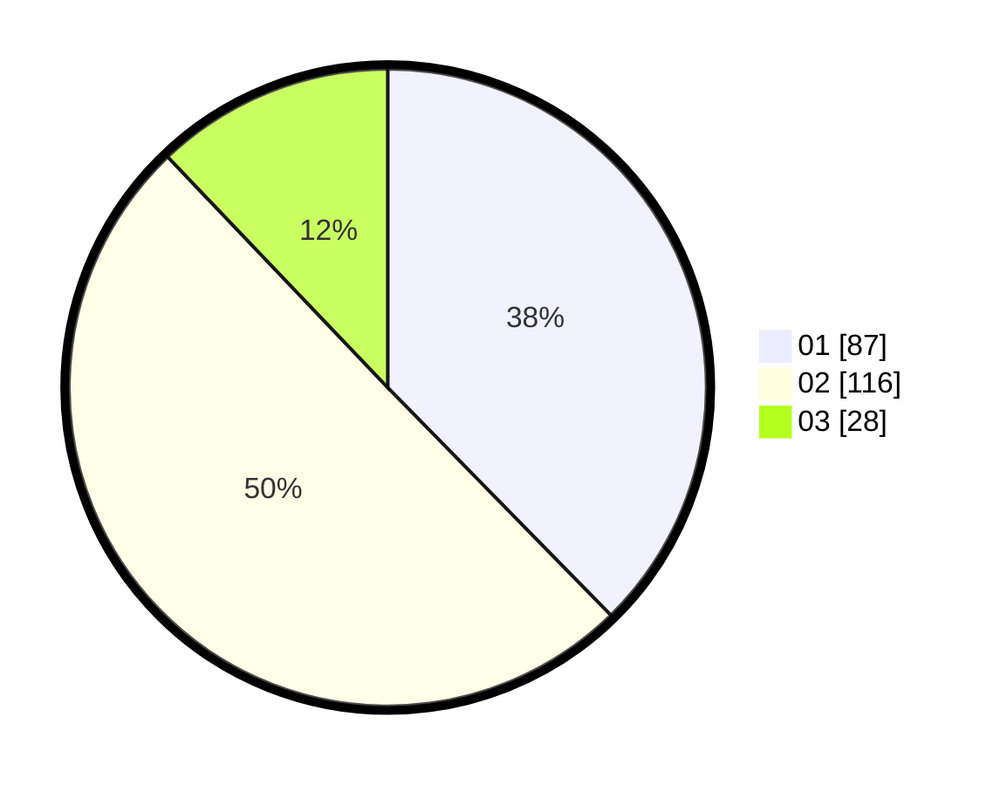

# Hasil

Hasil perolehan suara paslon dapat dilihat pada file paslon-01.txt, paslon-02.txt, dan paslon-03.txt.

Jika tidak ada, artinya data tersebut belum ada pada SIREKAP.

## Perolehan Suara

 * Paslon 01: **87**.
 * Paslon 02: **116**.
 * Paslon 03: **28**.

## Foto C Plano

https://sirekap-obj-formc.kpu.go.id/8543/pemilu/ppwp/31/73/06/10/03/3173061003100-20240214-222335--72ffbe47-c554-43f4-bfc8-0a60f3ff2940.jpg

https://sirekap-obj-formc.kpu.go.id/8543/pemilu/ppwp/31/73/06/10/03/3173061003100-20240214-222559--3224b4c3-9081-419e-9e28-8af36cc5cf23.jpg

https://sirekap-obj-formc.kpu.go.id/8543/pemilu/ppwp/31/73/06/10/03/3173061003100-20240214-222703--92da3601-379b-4129-be0a-423d656293eb.jpg
