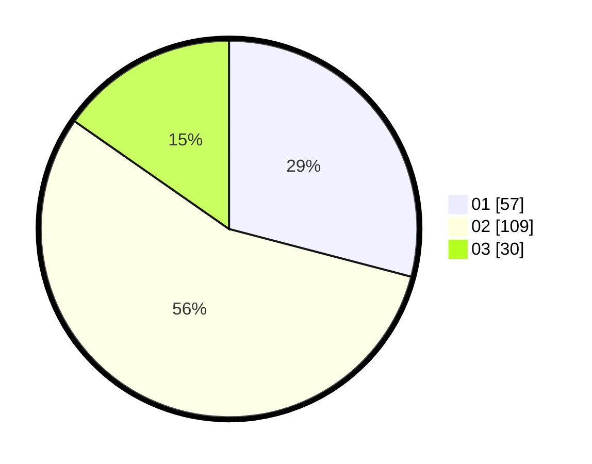

# Hasil

Hasil perolehan suara paslon dapat dilihat pada file paslon-01.txt, paslon-02.txt, dan paslon-03.txt.

Jika tidak ada, artinya data tersebut belum ada pada SIREKAP.

## Perolehan Suara

 * Paslon 01: **57**.
 * Paslon 02: **109**.
 * Paslon 03: **30**.

## Foto C Plano

https://sirekap-obj-formc.kpu.go.id/a359/pemilu/ppwp/31/73/06/10/03/3173061003102-20240215-012504--9084c907-45e7-4d51-9e5f-0aca2bdeb3b9.jpg

https://sirekap-obj-formc.kpu.go.id/a359/pemilu/ppwp/31/73/06/10/03/3173061003102-20240215-012623--f698395c-b0bc-4f41-a50c-58386f8ce90a.jpg

https://sirekap-obj-formc.kpu.go.id/a359/pemilu/ppwp/31/73/06/10/03/3173061003102-20240215-012723--3f75c3c0-ec4d-4f83-98b8-8c96541644b7.jpg
