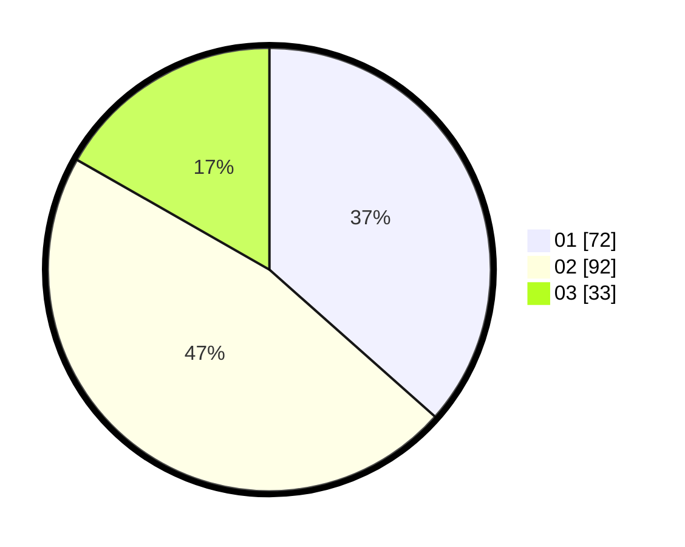

# Hasil

Hasil perolehan suara paslon dapat dilihat pada file paslon-01.txt, paslon-02.txt, dan paslon-03.txt.

Jika tidak ada, artinya data tersebut belum ada pada SIREKAP.

## Perolehan Suara

 * Paslon 01: **72**.
 * Paslon 02: **92**.
 * Paslon 03: **33**.

## Foto C Plano

https://sirekap-obj-formc.kpu.go.id/547d/pemilu/ppwp/31/73/06/10/03/3173061003103-20240214-231232--63bc34d1-bb6a-47aa-b043-959955164013.jpg

https://sirekap-obj-formc.kpu.go.id/547d/pemilu/ppwp/31/73/06/10/03/3173061003103-20240214-231247--d4390d66-c3a0-4894-9bbd-e9dfddadb5fa.jpg

https://sirekap-obj-formc.kpu.go.id/547d/pemilu/ppwp/31/73/06/10/03/3173061003103-20240214-231257--ce72cf65-0db0-4d55-b007-f7f4cba318cc.jpg
