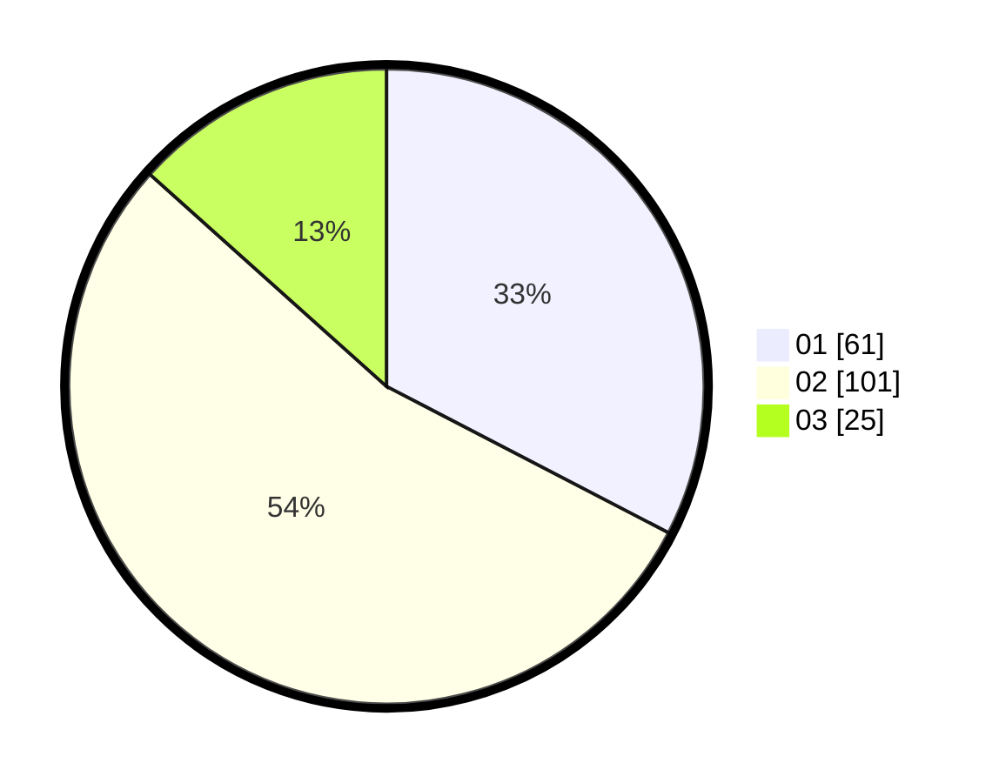

# Hasil

Hasil perolehan suara paslon dapat dilihat pada file paslon-01.txt, paslon-02.txt, dan paslon-03.txt.

Jika tidak ada, artinya data tersebut belum ada pada SIREKAP.

## Perolehan Suara

 * Paslon 01: **61**.
 * Paslon 02: **101**.
 * Paslon 03: **25**.

## Foto C Plano

https://sirekap-obj-formc.kpu.go.id/7c2b/pemilu/ppwp/31/73/06/10/03/3173061003104-20240214-225708--28e55800-371a-42fe-9f63-577fd65932c0.jpg

https://sirekap-obj-formc.kpu.go.id/7c2b/pemilu/ppwp/31/73/06/10/03/3173061003104-20240214-225802--48ce6bdd-cd5f-4d7a-8079-8797d8f26537.jpg

https://sirekap-obj-formc.kpu.go.id/7c2b/pemilu/ppwp/31/73/06/10/03/3173061003104-20240214-225845--c4c058fc-a937-4e6d-b9bf-bebb0da90a25.jpg

## DATA PEMILIH TETAP

Jumlah pemilih dalam DPT: **245**.
 * L: **127**.
 * P: **118**.

## DATA PENGGUNA HAK PILIH

Jumlah pengguna hak pilih dalam DPT: **190**.
 * L: **94**.
 * P: **95**.

Jumlah pengguna hak pilih dalam DPTb: **0**.
 * L: **0**.
 * P: **0**.

Jumlah pengguna hak pilih dalam DPK: **1**.
 * L: **0**.
 * P: **1**.

Jumlah pengguna hak pilih: **191**.
 * L: **94**.
 * P: **97**.

## JUMLAH SUARA SAH DAN TIDAK SAH

JUMLAH SELURUH SUARA SAH: **187**.

JUMLAH SUARA TIDAK SAH: **4**.

JUMLAH SELURUH SUARA SAH DAN SUARA TIDAK SAH: **191**.
