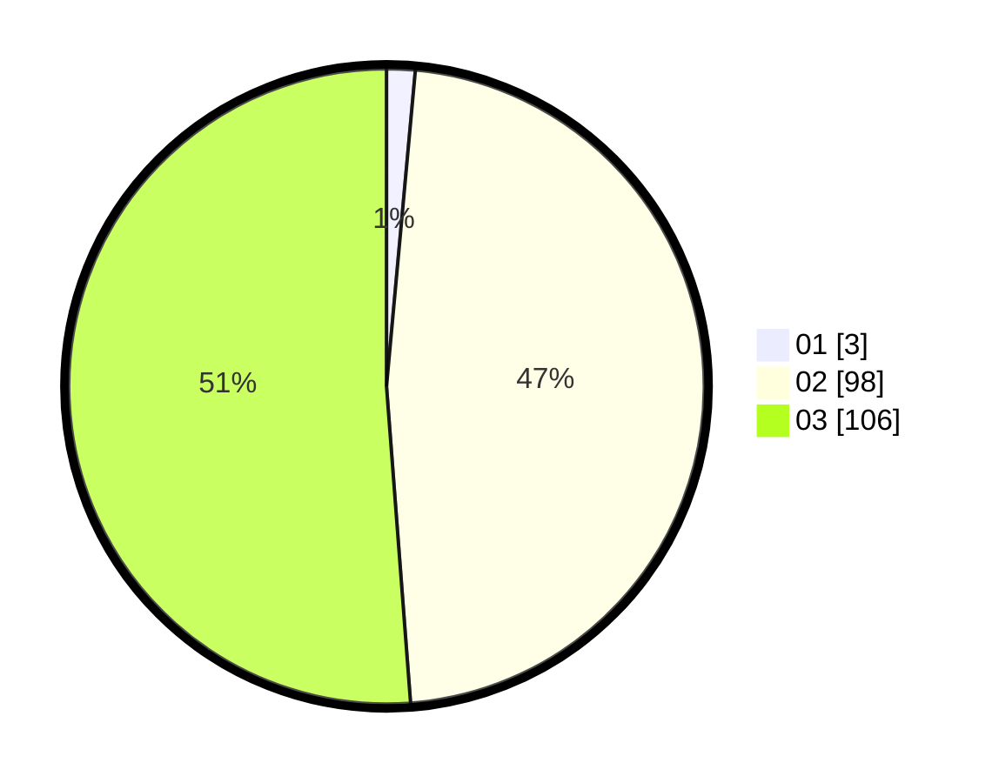

# Hasil

Hasil perolehan suara paslon dapat dilihat pada file paslon-01.txt, paslon-02.txt, dan paslon-03.txt.

Jika tidak ada, artinya data tersebut belum ada pada SIREKAP.

## Perolehan Suara

 * Paslon 01: **3**.
 * Paslon 02: **98**.
 * Paslon 03: **106**.

## Foto C Plano

https://sirekap-obj-formc.kpu.go.id/035f/pemilu/ppwp/31/73/06/10/03/3173061003106-20240214-222642--32aba1bc-22bc-4860-910a-7d6ab0a329c4.jpg

https://sirekap-obj-formc.kpu.go.id/035f/pemilu/ppwp/31/73/06/10/03/3173061003106-20240214-222741--57dc30fd-e30f-48d3-95dc-3899a7828649.jpg

https://sirekap-obj-formc.kpu.go.id/035f/pemilu/ppwp/31/73/06/10/03/3173061003106-20240214-222838--7cf5bdb7-4219-4150-bd4d-05dcf0233c63.jpg

## DATA PEMILIH TETAP

Jumlah pemilih dalam DPT: **275**.
 * L: **131**.
 * P: **144**.

## DATA PENGGUNA HAK PILIH

Jumlah pengguna hak pilih dalam DPT: **187**.
 * L: **92**.
 * P: **95**.

Jumlah pengguna hak pilih dalam DPTb: **19**.
 * L: **2**.
 * P: **17**.

Jumlah pengguna hak pilih dalam DPK: **3**.
 * L: **0**.
 * P: **3**.

Jumlah pengguna hak pilih: **209**.
 * L: **94**.
 * P: **115**.

## JUMLAH SUARA SAH DAN TIDAK SAH

JUMLAH SELURUH SUARA SAH: **207**.

JUMLAH SUARA TIDAK SAH: **2**.

JUMLAH SELURUH SUARA SAH DAN SUARA TIDAK SAH: **209**.
