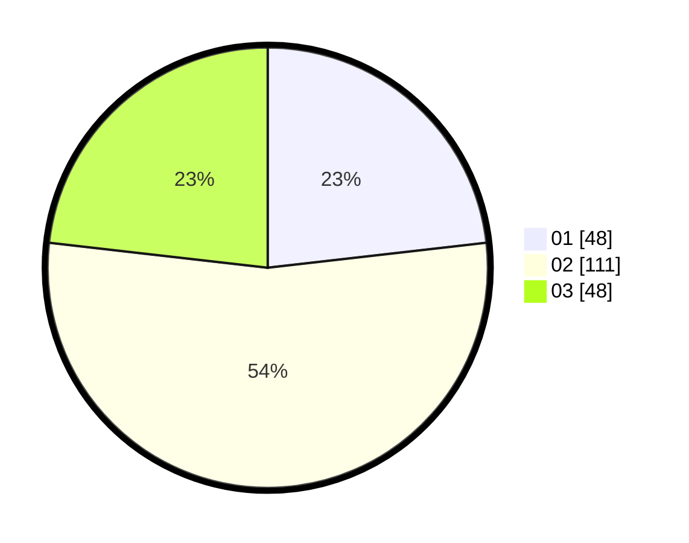

# Hasil

Hasil perolehan suara paslon dapat dilihat pada file paslon-01.txt, paslon-02.txt, dan paslon-03.txt.

Jika tidak ada, artinya data tersebut belum ada pada SIREKAP.

## Perolehan Suara

 * Paslon 01: **48**.
 * Paslon 02: **111**.
 * Paslon 03: **48**.

## Foto C Plano

https://sirekap-obj-formc.kpu.go.id/882c/pemilu/ppwp/31/73/06/10/03/3173061003108-20240215-132928--2131d41d-0f8d-4924-af22-54835e3fdcdc.jpg

https://sirekap-obj-formc.kpu.go.id/882c/pemilu/ppwp/31/73/06/10/03/3173061003108-20240215-132954--78b87bb1-6232-4151-88fb-53844dcdba81.jpg

https://sirekap-obj-formc.kpu.go.id/882c/pemilu/ppwp/31/73/06/10/03/3173061003108-20240215-133008--c79bb370-6781-4833-b34b-bcb04fe2f520.jpg

## DATA PEMILIH TETAP

Jumlah pemilih dalam DPT: **280**.
 * L: **141**.
 * P: **139**.

## DATA PENGGUNA HAK PILIH

Jumlah pengguna hak pilih dalam DPT: **205**.
 * L: **97**.
 * P: **108**.

Jumlah pengguna hak pilih dalam DPTb: **0**.
 * L: **0**.
 * P: **0**.

Jumlah pengguna hak pilih dalam DPK: **3**.
 * L: **1**.
 * P: **2**.

Jumlah pengguna hak pilih: **208**.
 * L: **98**.
 * P: **110**.

## JUMLAH SUARA SAH DAN TIDAK SAH

JUMLAH SELURUH SUARA SAH: **207**.

JUMLAH SUARA TIDAK SAH: **1**.

JUMLAH SELURUH SUARA SAH DAN SUARA TIDAK SAH: **208**.
