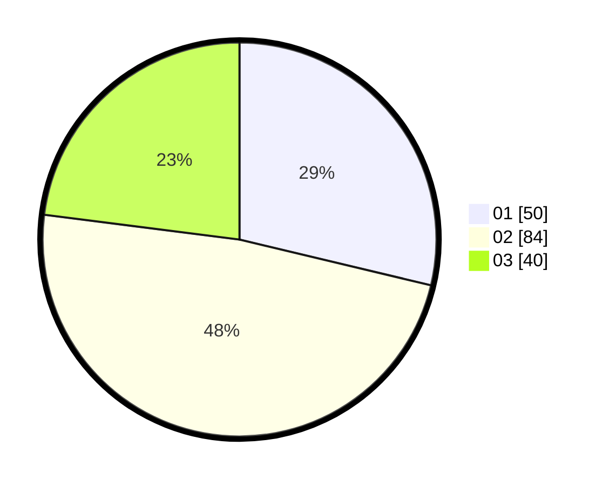

# Hasil

Hasil perolehan suara paslon dapat dilihat pada file paslon-01.txt, paslon-02.txt, dan paslon-03.txt.

Jika tidak ada, artinya data tersebut belum ada pada SIREKAP.

## Perolehan Suara

 * Paslon 01: **50**.
 * Paslon 02: **84**.
 * Paslon 03: **40**.

## Foto C Plano

https://sirekap-obj-formc.kpu.go.id/74a1/pemilu/ppwp/31/73/06/10/03/3173061003111-20240216-040616--0654d16e-c2e3-4f18-ba0f-274b4fba9aeb.jpg

https://sirekap-obj-formc.kpu.go.id/74a1/pemilu/ppwp/31/73/06/10/03/3173061003111-20240216-040628--5d1536c7-880c-4016-ae5b-d3e8efa1411a.jpg

https://sirekap-obj-formc.kpu.go.id/74a1/pemilu/ppwp/31/73/06/10/03/3173061003111-20240216-040624--8ef050f4-84ff-4aa6-b564-b47ee77398db.jpg

## DATA PEMILIH TETAP

Jumlah pemilih dalam DPT: **0**.
 * L: **0**.
 * P: **0**.

## DATA PENGGUNA HAK PILIH

Jumlah pengguna hak pilih dalam DPT: **0**.
 * L: **0**.
 * P: **0**.

Jumlah pengguna hak pilih dalam DPTb: **0**.
 * L: **0**.
 * P: **0**.

Jumlah pengguna hak pilih dalam DPK: **0**.
 * L: **0**.
 * P: **0**.

Jumlah pengguna hak pilih: **0**.
 * L: **0**.
 * P: **0**.

## JUMLAH SUARA SAH DAN TIDAK SAH

JUMLAH SELURUH SUARA SAH: **174**.

JUMLAH SUARA TIDAK SAH: **5**.

JUMLAH SELURUH SUARA SAH DAN SUARA TIDAK SAH: **179**.
