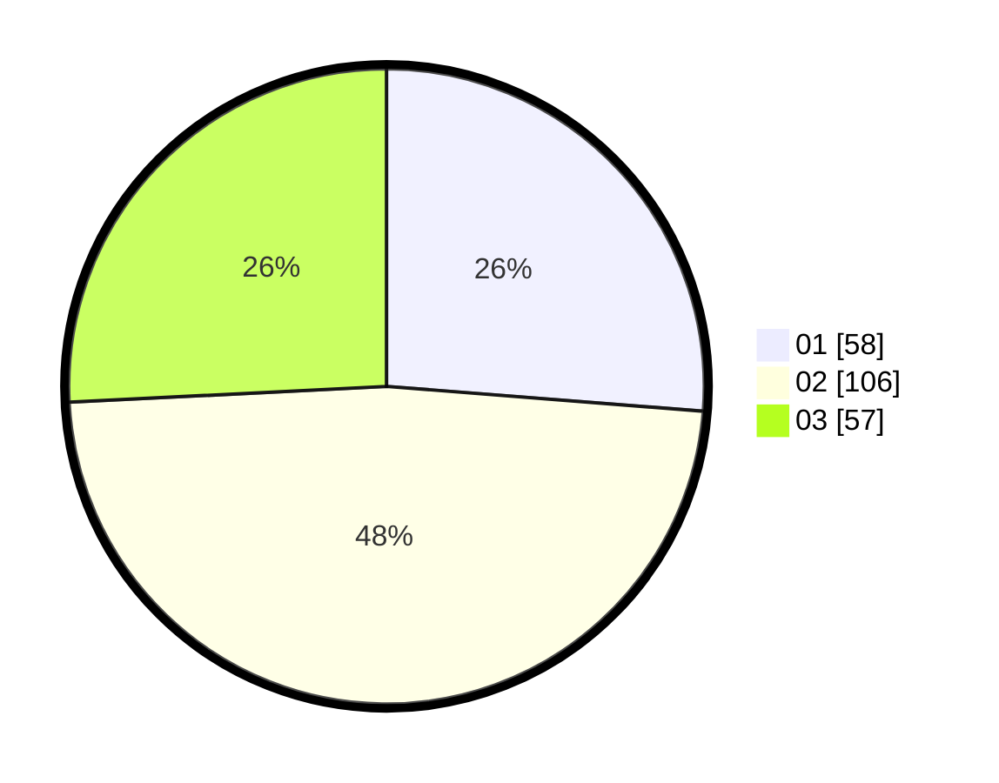

# Hasil

Hasil perolehan suara paslon dapat dilihat pada file paslon-01.txt, paslon-02.txt, dan paslon-03.txt.

Jika tidak ada, artinya data tersebut belum ada pada SIREKAP.

## Perolehan Suara

 * Paslon 01: **58**.
 * Paslon 02: **106**.
 * Paslon 03: **57**.

## Foto C Plano

https://sirekap-obj-formc.kpu.go.id/ab6b/pemilu/ppwp/31/73/06/10/03/3173061003116-20240215-160912--b915c18f-16de-43db-9a1e-7db20078de58.jpg

https://sirekap-obj-formc.kpu.go.id/ab6b/pemilu/ppwp/31/73/06/10/03/3173061003116-20240215-160932--61ee1fb0-3340-4450-bcf9-f5b5f0af3938.jpg

https://sirekap-obj-formc.kpu.go.id/ab6b/pemilu/ppwp/31/73/06/10/03/3173061003116-20240215-160954--cd4d288d-a3cd-4401-acdd-f49bee88a495.jpg
