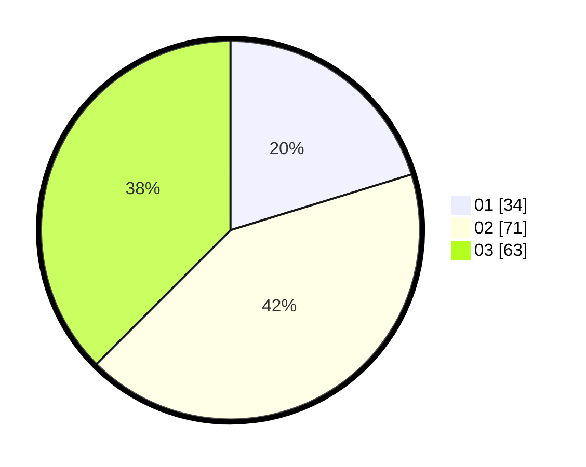

# Hasil

Hasil perolehan suara paslon dapat dilihat pada file paslon-01.txt, paslon-02.txt, dan paslon-03.txt.

Jika tidak ada, artinya data tersebut belum ada pada SIREKAP.

## Perolehan Suara

 * Paslon 01: **34**.
 * Paslon 02: **71**.
 * Paslon 03: **63**.

## Foto C Plano

https://sirekap-obj-formc.kpu.go.id/a05e/pemilu/ppwp/31/73/06/10/03/3173061003120-20240214-230338--d3f1c9d5-2f40-4ec7-ab47-6576df7bdcd0.jpg

https://sirekap-obj-formc.kpu.go.id/a05e/pemilu/ppwp/31/73/06/10/03/3173061003120-20240214-230724--18d78b58-ac34-41b4-8ad5-e97105c0c56c.jpg

https://sirekap-obj-formc.kpu.go.id/a05e/pemilu/ppwp/31/73/06/10/03/3173061003120-20240214-230910--ed45e629-a826-4aff-8875-82241044f5ff.jpg
