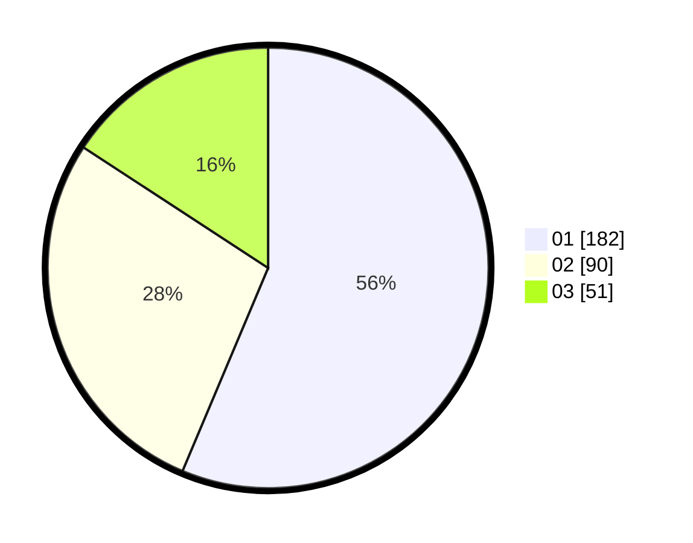

# Hasil

Hasil perolehan suara paslon dapat dilihat pada file paslon-01.txt, paslon-02.txt, dan paslon-03.txt.

Jika tidak ada, artinya data tersebut belum ada pada SIREKAP.

## Perolehan Suara

 * Paslon 01: **182**.
 * Paslon 02: **90**.
 * Paslon 03: **51**.

## Foto C Plano

https://sirekap-obj-formc.kpu.go.id/61a6/pemilu/ppwp/31/73/06/10/03/3173061003122-20240216-010421--ba3ee432-8144-4185-973d-2091d613af47.jpg

https://sirekap-obj-formc.kpu.go.id/61a6/pemilu/ppwp/31/73/06/10/03/3173061003122-20240216-010422--f800ca16-dd58-43ef-b82b-e6f4dcc341d7.jpg

https://sirekap-obj-formc.kpu.go.id/61a6/pemilu/ppwp/31/73/06/10/03/3173061003122-20240216-010422--6a1a0159-1e46-4a28-8f20-8a29dc1bcb7f.jpg

## DATA PEMILIH TETAP

Jumlah pemilih dalam DPT: **290**.
 * L: **142**.
 * P: **148**.

## DATA PENGGUNA HAK PILIH

Jumlah pengguna hak pilih dalam DPT: **226**.
 * L: **106**.
 * P: **120**.

Jumlah pengguna hak pilih dalam DPTb: **1**.
 * L: **1**.
 * P: **0**.

Jumlah pengguna hak pilih dalam DPK: **1**.
 * L: **1**.
 * P: **0**.

Jumlah pengguna hak pilih: **228**.
 * L: **108**.
 * P: **120**.

## JUMLAH SUARA SAH DAN TIDAK SAH

JUMLAH SELURUH SUARA SAH: **223**.

JUMLAH SUARA TIDAK SAH: **5**.

JUMLAH SELURUH SUARA SAH DAN SUARA TIDAK SAH: **228**.
