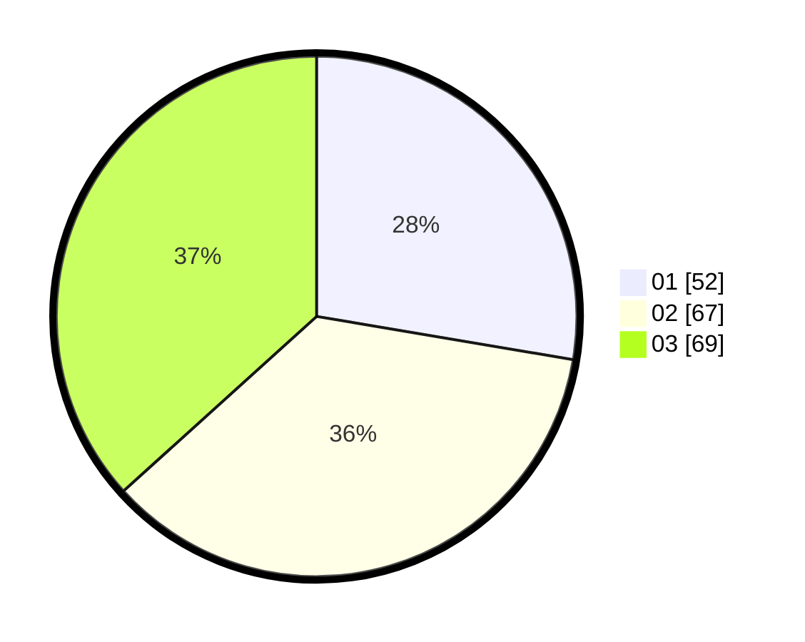

# Hasil

Hasil perolehan suara paslon dapat dilihat pada file paslon-01.txt, paslon-02.txt, dan paslon-03.txt.

Jika tidak ada, artinya data tersebut belum ada pada SIREKAP.

## Perolehan Suara

 * Paslon 01: **52**.
 * Paslon 02: **67**.
 * Paslon 03: **69**.

## Foto C Plano

https://sirekap-obj-formc.kpu.go.id/34ca/pemilu/ppwp/31/73/06/10/03/3173061003123-20240215-211920--13b64f0c-38b8-41fa-87fc-0d242f3c6d4c.jpg

https://sirekap-obj-formc.kpu.go.id/34ca/pemilu/ppwp/31/73/06/10/03/3173061003123-20240215-211922--797d6dab-ea48-4507-8991-149d00982410.jpg

https://sirekap-obj-formc.kpu.go.id/34ca/pemilu/ppwp/31/73/06/10/03/3173061003123-20240215-211921--ac74e2c0-2853-419e-8069-f56f66a59dbd.jpg

## DATA PEMILIH TETAP

Jumlah pemilih dalam DPT: **252**.
 * L: **119**.
 * P: **133**.

## DATA PENGGUNA HAK PILIH

Jumlah pengguna hak pilih dalam DPT: **191**.
 * L: **83**.
 * P: **109**.

Jumlah pengguna hak pilih dalam DPTb: **0**.
 * L: **0**.
 * P: **0**.

Jumlah pengguna hak pilih dalam DPK: **0**.
 * L: **0**.
 * P: **0**.

Jumlah pengguna hak pilih: **191**.
 * L: **83**.
 * P: **108**.

## JUMLAH SUARA SAH DAN TIDAK SAH

JUMLAH SELURUH SUARA SAH: **188**.

JUMLAH SUARA TIDAK SAH: **3**.

JUMLAH SELURUH SUARA SAH DAN SUARA TIDAK SAH: **191**.
