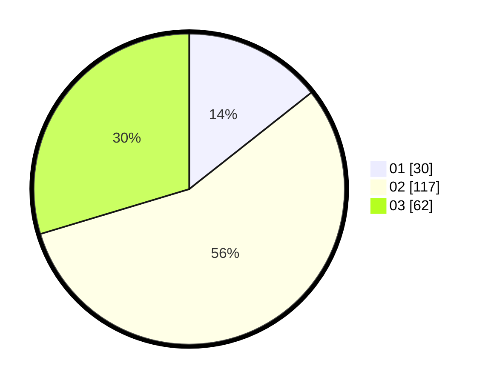

# Hasil

Hasil perolehan suara paslon dapat dilihat pada file paslon-01.txt, paslon-02.txt, dan paslon-03.txt.

Jika tidak ada, artinya data tersebut belum ada pada SIREKAP.

## Perolehan Suara

 * Paslon 01: **30**.
 * Paslon 02: **117**.
 * Paslon 03: **62**.

## Foto C Plano

https://sirekap-obj-formc.kpu.go.id/3be3/pemilu/ppwp/31/73/06/10/03/3173061003125-20240214-210837--0db43651-3bc5-4ac3-98b4-1de7c6b14de1.jpg

https://sirekap-obj-formc.kpu.go.id/3be3/pemilu/ppwp/31/73/06/10/03/3173061003125-20240214-211022--75b92afa-dd05-4e8f-bb37-b3b566154303.jpg

https://sirekap-obj-formc.kpu.go.id/3be3/pemilu/ppwp/31/73/06/10/03/3173061003125-20240214-211237--3165ba12-f39b-485d-a88b-ae792a1b3d34.jpg

## DATA PEMILIH TETAP

Jumlah pemilih dalam DPT: **268**.
 * L: **122**.
 * P: **146**.

## DATA PENGGUNA HAK PILIH

Jumlah pengguna hak pilih dalam DPT: **209**.
 * L: **96**.
 * P: **113**.

Jumlah pengguna hak pilih dalam DPTb: **0**.
 * L: **0**.
 * P: **0**.

Jumlah pengguna hak pilih dalam DPK: **1**.
 * L: **1**.
 * P: **0**.

Jumlah pengguna hak pilih: **210**.
 * L: **97**.
 * P: **113**.

## JUMLAH SUARA SAH DAN TIDAK SAH

JUMLAH SELURUH SUARA SAH: **209**.

JUMLAH SUARA TIDAK SAH: **1**.

JUMLAH SELURUH SUARA SAH DAN SUARA TIDAK SAH: **210**.
