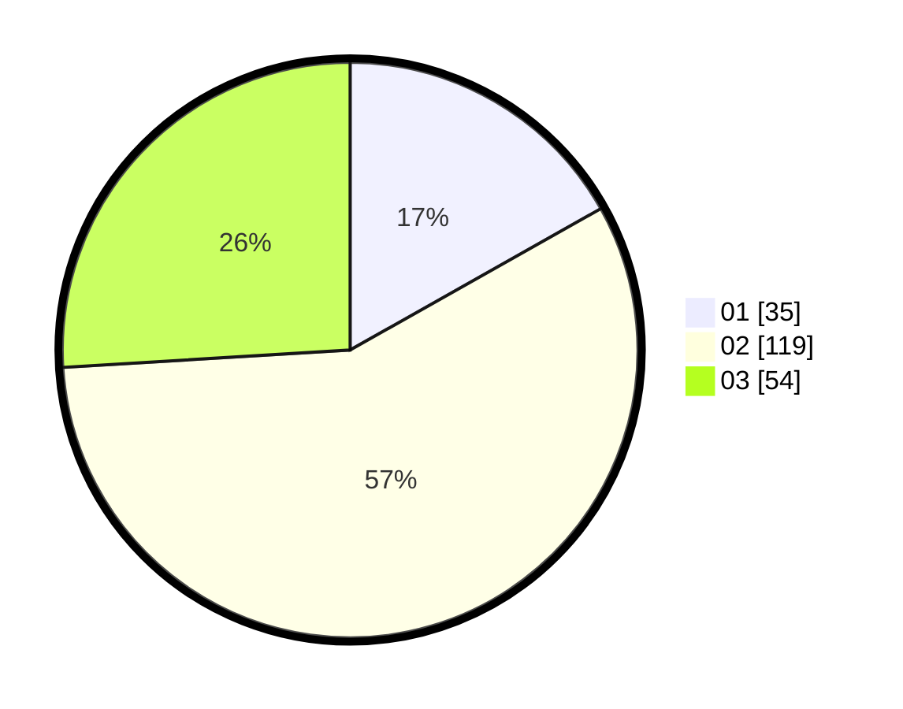

# Hasil

Hasil perolehan suara paslon dapat dilihat pada file paslon-01.txt, paslon-02.txt, dan paslon-03.txt.

Jika tidak ada, artinya data tersebut belum ada pada SIREKAP.

## Perolehan Suara

 * Paslon 01: **35**.
 * Paslon 02: **119**.
 * Paslon 03: **54**.

## Foto C Plano

https://sirekap-obj-formc.kpu.go.id/6e25/pemilu/ppwp/31/73/06/10/03/3173061003129-20240215-110826--abd61afb-a70c-4400-8c97-570d01bd4a50.jpg

https://sirekap-obj-formc.kpu.go.id/6e25/pemilu/ppwp/31/73/06/10/03/3173061003129-20240215-110815--15f0a874-442f-479c-a0a4-f3eb06abd3cd.jpg
