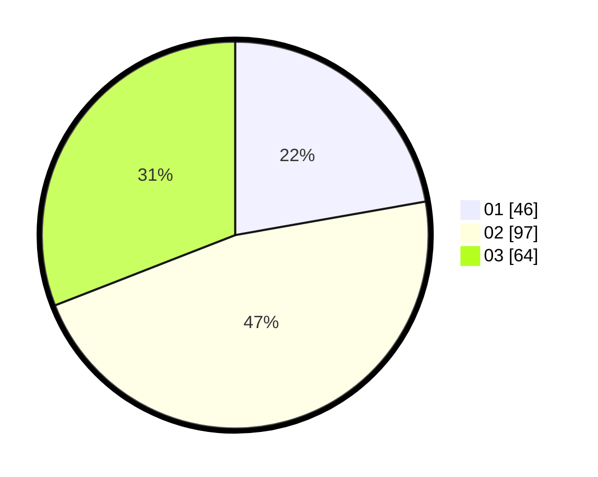

# Hasil

Hasil perolehan suara paslon dapat dilihat pada file paslon-01.txt, paslon-02.txt, dan paslon-03.txt.

Jika tidak ada, artinya data tersebut belum ada pada SIREKAP.

## Perolehan Suara

 * Paslon 01: **46**.
 * Paslon 02: **97**.
 * Paslon 03: **64**.

## Foto C Plano

https://sirekap-obj-formc.kpu.go.id/3923/pemilu/ppwp/31/73/06/10/03/3173061003134-20240214-222138--b6577fb1-79b4-40a6-8d20-29894fbb09cb.jpg

https://sirekap-obj-formc.kpu.go.id/3923/pemilu/ppwp/31/73/06/10/03/3173061003134-20240214-222228--e8d11077-b84b-4db4-8c18-d6ded30916b3.jpg

https://sirekap-obj-formc.kpu.go.id/3923/pemilu/ppwp/31/73/06/10/03/3173061003134-20240214-222312--63b9c4e6-6548-479e-8366-9dc91877e4d8.jpg
