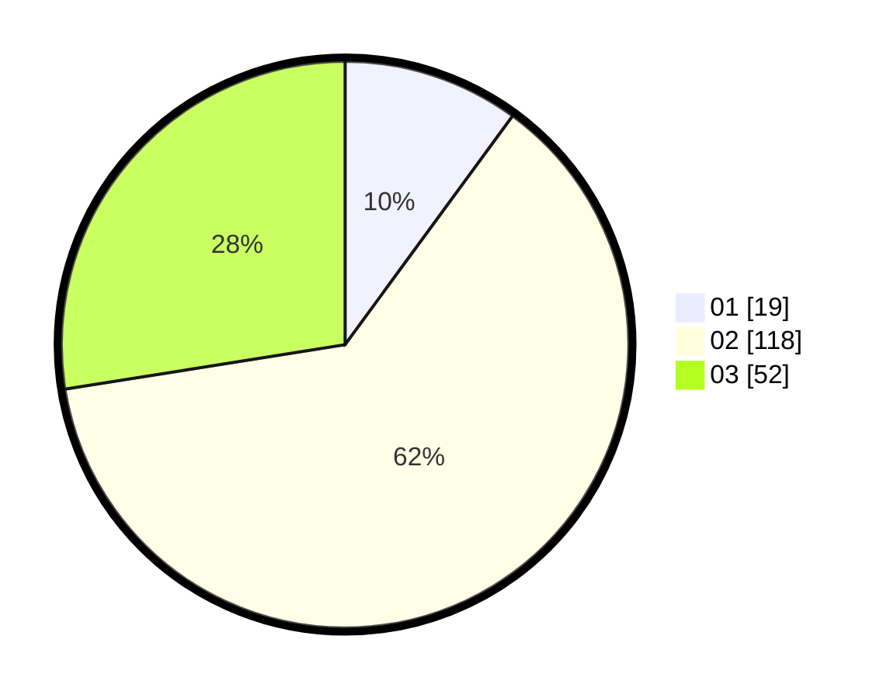

# Hasil

Hasil perolehan suara paslon dapat dilihat pada file paslon-01.txt, paslon-02.txt, dan paslon-03.txt.

Jika tidak ada, artinya data tersebut belum ada pada SIREKAP.

## Perolehan Suara

 * Paslon 01: **19**.
 * Paslon 02: **118**.
 * Paslon 03: **52**.

## Foto C Plano

https://sirekap-obj-formc.kpu.go.id/f1c0/pemilu/ppwp/31/73/06/10/03/3173061003137-20240214-190326--3402d7e3-426e-49d4-911b-52bd3a610737.jpg

https://sirekap-obj-formc.kpu.go.id/f1c0/pemilu/ppwp/31/73/06/10/03/3173061003137-20240214-191954--a2f0a3a5-cea5-4c48-b253-ed37e73f4010.jpg

https://sirekap-obj-formc.kpu.go.id/f1c0/pemilu/ppwp/31/73/06/10/03/3173061003137-20240214-190348--95ee8325-d720-41b1-9e09-bd19daadc367.jpg

## DATA PEMILIH TETAP

Jumlah pemilih dalam DPT: **279**.
 * L: **131**.
 * P: **148**.

## DATA PENGGUNA HAK PILIH

Jumlah pengguna hak pilih dalam DPT: **192**.
 * L: **86**.
 * P: **106**.

Jumlah pengguna hak pilih dalam DPTb: **0**.
 * L: **0**.
 * P: **0**.

Jumlah pengguna hak pilih dalam DPK: **0**.
 * L: **0**.
 * P: **0**.

Jumlah pengguna hak pilih: **192**.
 * L: **86**.
 * P: **106**.

## JUMLAH SUARA SAH DAN TIDAK SAH

JUMLAH SELURUH SUARA SAH: **189**.

JUMLAH SUARA TIDAK SAH: **3**.

JUMLAH SELURUH SUARA SAH DAN SUARA TIDAK SAH: **192**.
