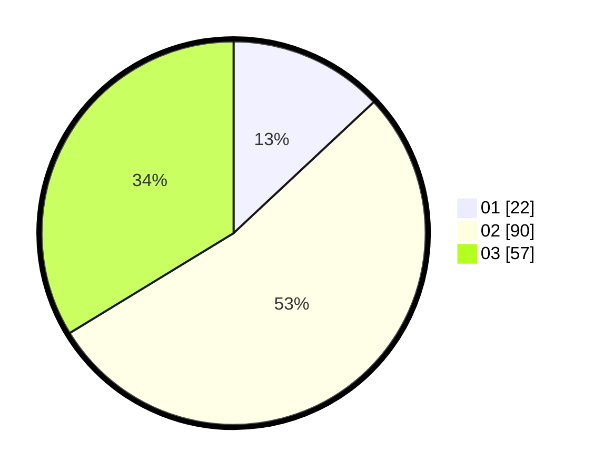

# Hasil

Hasil perolehan suara paslon dapat dilihat pada file paslon-01.txt, paslon-02.txt, dan paslon-03.txt.

Jika tidak ada, artinya data tersebut belum ada pada SIREKAP.

## Perolehan Suara

 * Paslon 01: **22**.
 * Paslon 02: **90**.
 * Paslon 03: **57**.

## Foto C Plano

https://sirekap-obj-formc.kpu.go.id/c5fd/pemilu/ppwp/31/73/06/10/03/3173061003140-20240215-002855--fc7ddcf4-2473-4008-b677-b959132bae17.jpg

https://sirekap-obj-formc.kpu.go.id/c5fd/pemilu/ppwp/31/73/06/10/03/3173061003140-20240214-212812--c12bf487-44c8-42f5-a61c-378e762df4a1.jpg

https://sirekap-obj-formc.kpu.go.id/c5fd/pemilu/ppwp/31/73/06/10/03/3173061003140-20240214-191559--7182ac13-f0e3-4148-ab5f-52d8b27e0dd4.jpg
