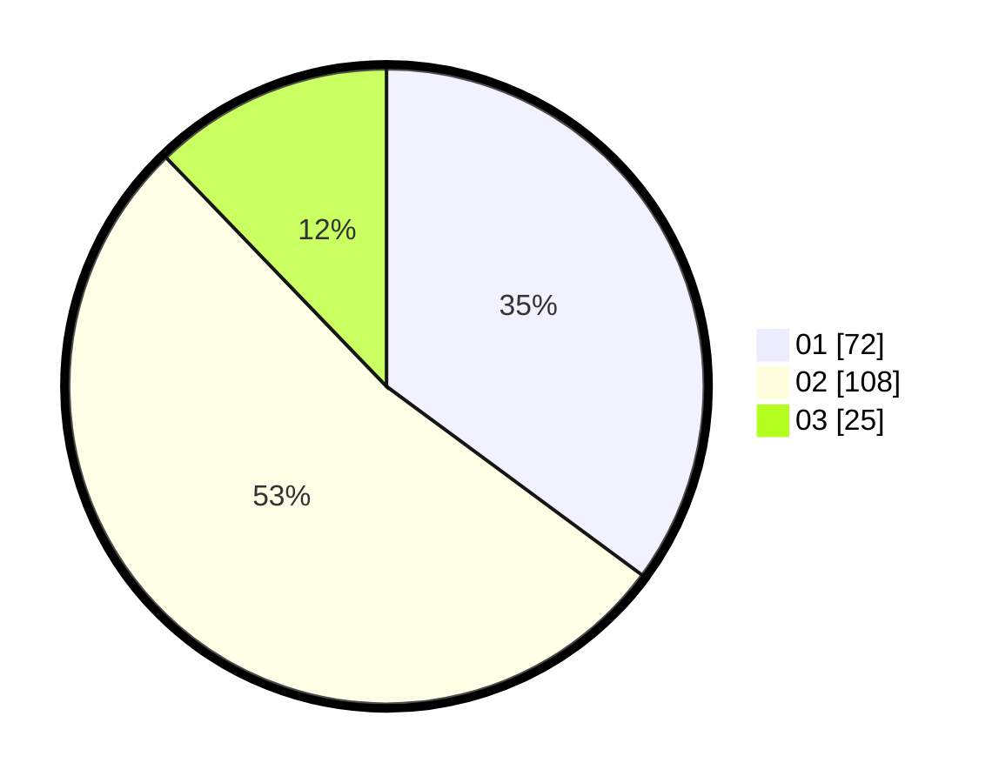

# Hasil

Hasil perolehan suara paslon dapat dilihat pada file paslon-01.txt, paslon-02.txt, dan paslon-03.txt.

Jika tidak ada, artinya data tersebut belum ada pada SIREKAP.

## Perolehan Suara

 * Paslon 01: **72**.
 * Paslon 02: **108**.
 * Paslon 03: **25**.

## Foto C Plano

https://sirekap-obj-formc.kpu.go.id/313f/pemilu/ppwp/31/73/06/10/03/3173061003143-20240214-211826--69214dc8-b8af-489d-8766-066f21ca35a0.jpg

https://sirekap-obj-formc.kpu.go.id/313f/pemilu/ppwp/31/73/06/10/03/3173061003143-20240214-212046--c7e3f0ff-8463-4b43-8773-fcb615b884f3.jpg

https://sirekap-obj-formc.kpu.go.id/313f/pemilu/ppwp/31/73/06/10/03/3173061003143-20240214-212144--448ece73-4a06-4071-ba36-9fb3b6ea4a3e.jpg
