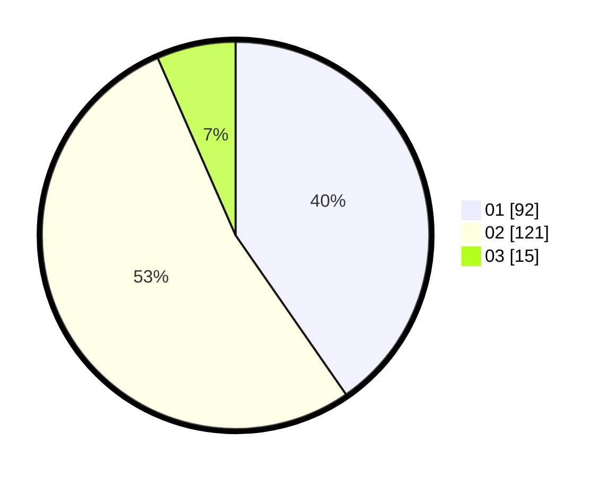

# Hasil

Hasil perolehan suara paslon dapat dilihat pada file paslon-01.txt, paslon-02.txt, dan paslon-03.txt.

Jika tidak ada, artinya data tersebut belum ada pada SIREKAP.

## Perolehan Suara

 * Paslon 01: **92**.
 * Paslon 02: **121**.
 * Paslon 03: **15**.

## Foto C Plano

https://sirekap-obj-formc.kpu.go.id/5d0e/pemilu/ppwp/31/73/06/10/03/3173061003146-20240215-005104--375ac4d1-fa98-4684-bee2-effb7a2a897f.jpg

https://sirekap-obj-formc.kpu.go.id/5d0e/pemilu/ppwp/31/73/06/10/03/3173061003146-20240215-005343--2430371f-123d-46ec-9997-5772ed0bfcd9.jpg

https://sirekap-obj-formc.kpu.go.id/5d0e/pemilu/ppwp/31/73/06/10/03/3173061003146-20240215-005515--00e12a72-12bb-4f72-9f05-cfa12907afb4.jpg
