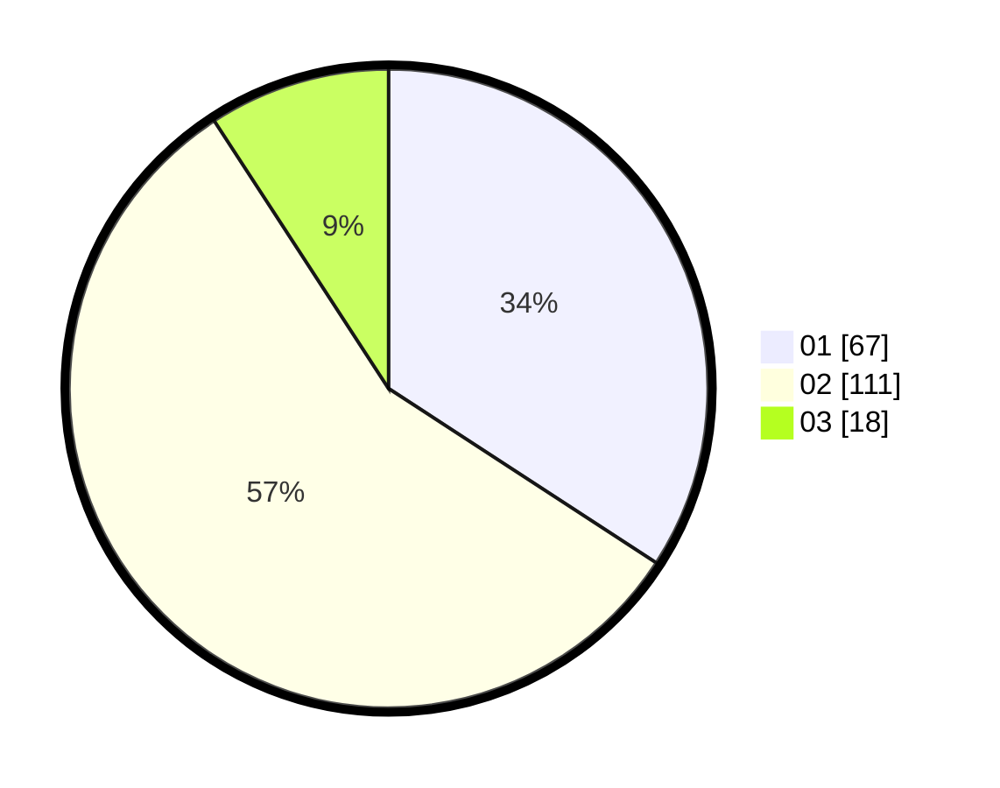

# Hasil

Hasil perolehan suara paslon dapat dilihat pada file paslon-01.txt, paslon-02.txt, dan paslon-03.txt.

Jika tidak ada, artinya data tersebut belum ada pada SIREKAP.

## Perolehan Suara

 * Paslon 01: **67**.
 * Paslon 02: **111**.
 * Paslon 03: **18**.

## Foto C Plano

https://sirekap-obj-formc.kpu.go.id/6ade/pemilu/ppwp/31/73/06/10/03/3173061003148-20240214-224659--11eaba71-bce4-483e-9cfc-1ba419c11a02.jpg

https://sirekap-obj-formc.kpu.go.id/6ade/pemilu/ppwp/31/73/06/10/03/3173061003148-20240214-224720--bd5ea805-3fb8-4c62-8fcc-9d30b87f6499.jpg

https://sirekap-obj-formc.kpu.go.id/6ade/pemilu/ppwp/31/73/06/10/03/3173061003148-20240214-224725--39d2fd40-8c7d-4ea2-b55e-26b17e4bcab2.jpg
