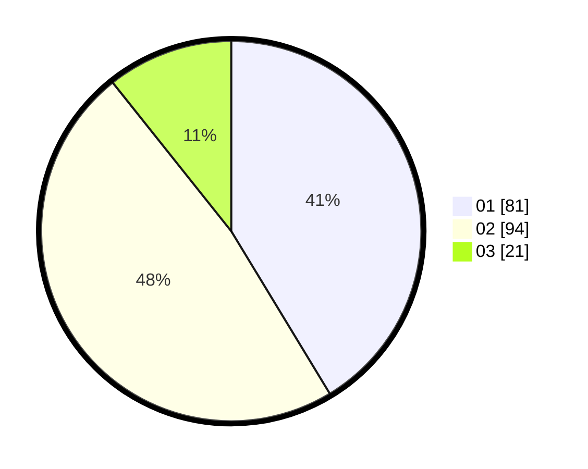

# Hasil

Hasil perolehan suara paslon dapat dilihat pada file paslon-01.txt, paslon-02.txt, dan paslon-03.txt.

Jika tidak ada, artinya data tersebut belum ada pada SIREKAP.

## Perolehan Suara

 * Paslon 01: **81**.
 * Paslon 02: **94**.
 * Paslon 03: **21**.

## Foto C Plano

https://sirekap-obj-formc.kpu.go.id/efd8/pemilu/ppwp/31/73/06/10/03/3173061003152-20240214-222834--1105f308-dacd-4d8e-8d4d-04288d73f04f.jpg

https://sirekap-obj-formc.kpu.go.id/efd8/pemilu/ppwp/31/73/06/10/03/3173061003152-20240214-223044--ee8c8edf-9cae-4176-8609-72d25cfa69f8.jpg

https://sirekap-obj-formc.kpu.go.id/efd8/pemilu/ppwp/31/73/06/10/03/3173061003152-20240214-223640--2b4bdb36-ead4-4dc7-bb1e-821fd87fc530.jpg
