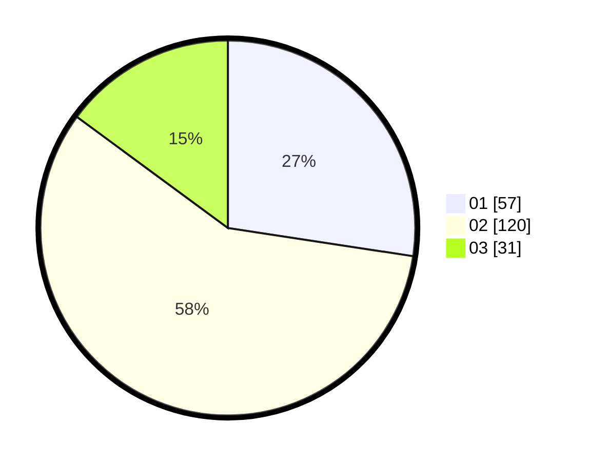

# Hasil

Hasil perolehan suara paslon dapat dilihat pada file paslon-01.txt, paslon-02.txt, dan paslon-03.txt.

Jika tidak ada, artinya data tersebut belum ada pada SIREKAP.

## Perolehan Suara

 * Paslon 01: **57**.
 * Paslon 02: **120**.
 * Paslon 03: **31**.

## Foto C Plano

https://sirekap-obj-formc.kpu.go.id/a0c1/pemilu/ppwp/31/73/06/10/03/3173061003154-20240216-151528--9ebd3d4b-4212-474a-9bde-995c7a2d689f.jpg

https://sirekap-obj-formc.kpu.go.id/a0c1/pemilu/ppwp/31/73/06/10/03/3173061003154-20240216-151529--e79d5b7c-3aaa-4733-91e1-50060c38067d.jpg

https://sirekap-obj-formc.kpu.go.id/a0c1/pemilu/ppwp/31/73/06/10/03/3173061003154-20240216-151529--90e3bbab-0034-49bc-9849-e047ef6ba281.jpg

## DATA PEMILIH TETAP

Jumlah pemilih dalam DPT: **256**.
 * L: **129**.
 * P: **127**.

## DATA PENGGUNA HAK PILIH

Jumlah pengguna hak pilih dalam DPT: **196**.
 * L: **99**.
 * P: **97**.

Jumlah pengguna hak pilih dalam DPTb: **12**.
 * L: **11**.
 * P: **1**.

Jumlah pengguna hak pilih dalam DPK: **3**.
 * L: **1**.
 * P: **2**.

Jumlah pengguna hak pilih: **211**.
 * L: **111**.
 * P: **100**.

## JUMLAH SUARA SAH DAN TIDAK SAH

JUMLAH SELURUH SUARA SAH: **208**.

JUMLAH SUARA TIDAK SAH: **3**.

JUMLAH SELURUH SUARA SAH DAN SUARA TIDAK SAH: **211**.
