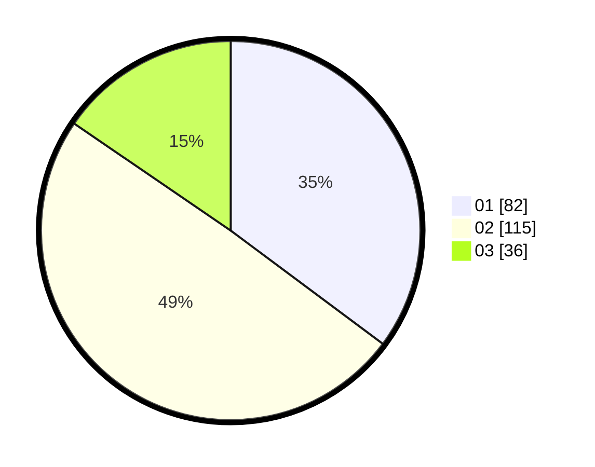

# Hasil

Hasil perolehan suara paslon dapat dilihat pada file paslon-01.txt, paslon-02.txt, dan paslon-03.txt.

Jika tidak ada, artinya data tersebut belum ada pada SIREKAP.

## Perolehan Suara

 * Paslon 01: **82**.
 * Paslon 02: **115**.
 * Paslon 03: **36**.

## Foto C Plano

https://sirekap-obj-formc.kpu.go.id/5630/pemilu/ppwp/31/73/06/10/03/3173061003160-20240214-204658--39d1e83c-0108-4caa-8344-872677f4ee93.jpg

https://sirekap-obj-formc.kpu.go.id/5630/pemilu/ppwp/31/73/06/10/03/3173061003160-20240216-003838--2851c7a7-f0c5-451e-b5de-f818b9f1ce92.jpg

https://sirekap-obj-formc.kpu.go.id/5630/pemilu/ppwp/31/73/06/10/03/3173061003160-20240214-205000--21b1eb15-8218-4b3c-9ba6-a99188aa1f62.jpg

## DATA PEMILIH TETAP

Jumlah pemilih dalam DPT: **275**.
 * L: **128**.
 * P: **147**.

## DATA PENGGUNA HAK PILIH

Jumlah pengguna hak pilih dalam DPT: **237**.
 * L: **113**.
 * P: **124**.

Jumlah pengguna hak pilih dalam DPTb: **0**.
 * L: **0**.
 * P: **0**.

Jumlah pengguna hak pilih dalam DPK: **5**.
 * L: **2**.
 * P: **3**.

Jumlah pengguna hak pilih: **242**.
 * L: **115**.
 * P: **127**.

## JUMLAH SUARA SAH DAN TIDAK SAH

JUMLAH SELURUH SUARA SAH: **233**.

JUMLAH SUARA TIDAK SAH: **9**.

JUMLAH SELURUH SUARA SAH DAN SUARA TIDAK SAH: **242**.
