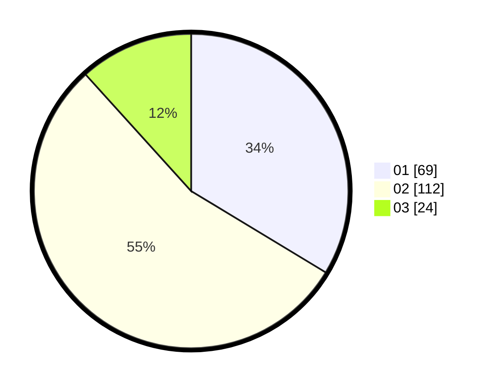

# Hasil

Hasil perolehan suara paslon dapat dilihat pada file paslon-01.txt, paslon-02.txt, dan paslon-03.txt.

Jika tidak ada, artinya data tersebut belum ada pada SIREKAP.

## Perolehan Suara

 * Paslon 01: **69**.
 * Paslon 02: **112**.
 * Paslon 03: **24**.

## Foto C Plano

https://sirekap-obj-formc.kpu.go.id/a615/pemilu/ppwp/31/73/06/10/03/3173061003166-20240214-231850--cbe07c99-7247-446d-8ab5-d0d10d86dd66.jpg

https://sirekap-obj-formc.kpu.go.id/a615/pemilu/ppwp/31/73/06/10/03/3173061003166-20240215-002656--0ce06d80-f8e5-4d73-9fa1-8ed868df43aa.jpg

https://sirekap-obj-formc.kpu.go.id/a615/pemilu/ppwp/31/73/06/10/03/3173061003166-20240214-235419--a40e04af-8c2b-4872-adde-7613b521587c.jpg
