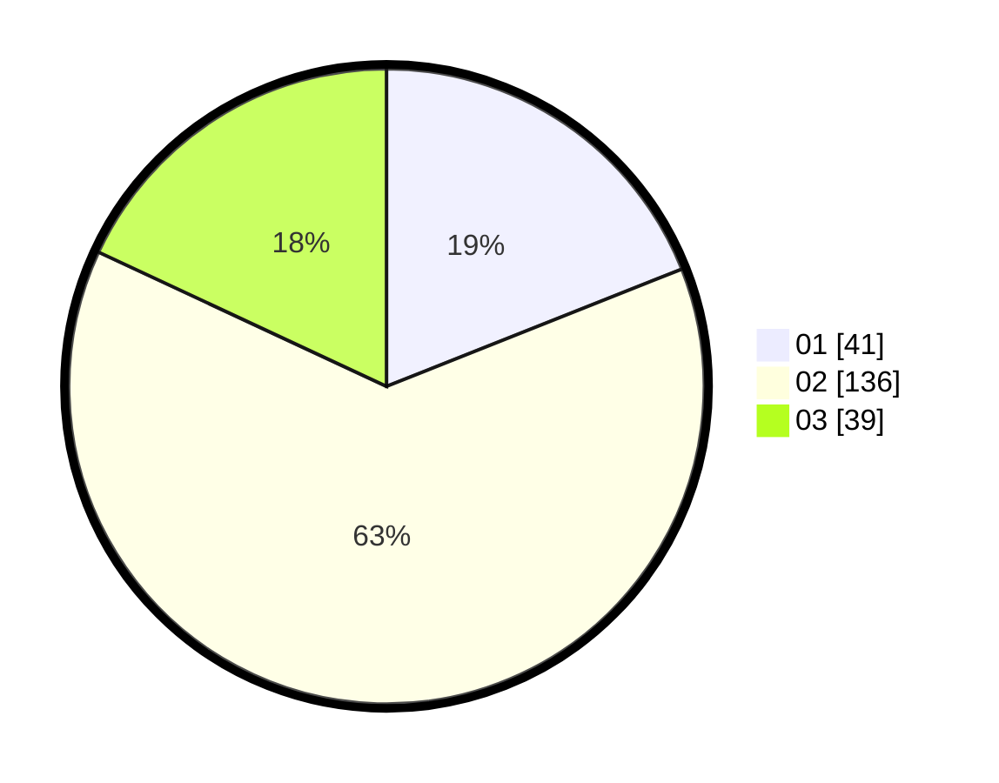

# Hasil

Hasil perolehan suara paslon dapat dilihat pada file paslon-01.txt, paslon-02.txt, dan paslon-03.txt.

Jika tidak ada, artinya data tersebut belum ada pada SIREKAP.

## Perolehan Suara

 * Paslon 01: **41**.
 * Paslon 02: **136**.
 * Paslon 03: **39**.

## Foto C Plano

https://sirekap-obj-formc.kpu.go.id/27c7/pemilu/ppwp/31/73/06/10/03/3173061003168-20240214-191859--3fb4570b-01d2-42c4-aa82-b4d586a179c6.jpg

https://sirekap-obj-formc.kpu.go.id/27c7/pemilu/ppwp/31/73/06/10/03/3173061003168-20240214-235259--4933cad1-fc22-419c-8afc-59888b47e134.jpg

https://sirekap-obj-formc.kpu.go.id/27c7/pemilu/ppwp/31/73/06/10/03/3173061003168-20240214-192212--8f85088b-e9c5-45e0-a101-35173440115e.jpg

## DATA PEMILIH TETAP

Jumlah pemilih dalam DPT: **279**.
 * L: **141**.
 * P: **138**.

## DATA PENGGUNA HAK PILIH

Jumlah pengguna hak pilih dalam DPT: **213**.
 * L: **106**.
 * P: **107**.

Jumlah pengguna hak pilih dalam DPTb: **4**.
 * L: **1**.
 * P: **3**.

Jumlah pengguna hak pilih dalam DPK: **0**.
 * L: **0**.
 * P: **0**.

Jumlah pengguna hak pilih: **217**.
 * L: **107**.
 * P: **110**.

## JUMLAH SUARA SAH DAN TIDAK SAH

JUMLAH SELURUH SUARA SAH: **216**.

JUMLAH SUARA TIDAK SAH: **1**.

JUMLAH SELURUH SUARA SAH DAN SUARA TIDAK SAH: **217**.
