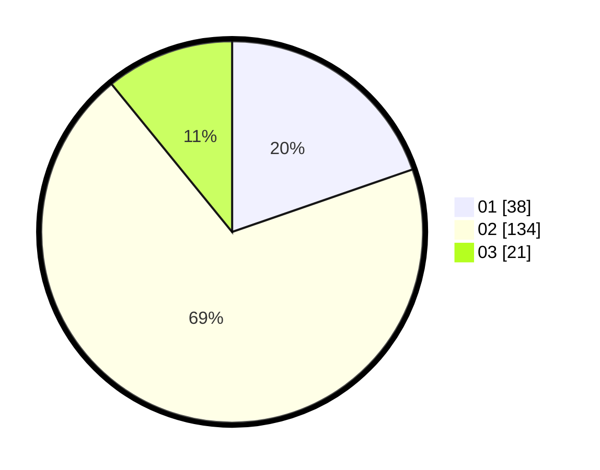

# Hasil

Hasil perolehan suara paslon dapat dilihat pada file paslon-01.txt, paslon-02.txt, dan paslon-03.txt.

Jika tidak ada, artinya data tersebut belum ada pada SIREKAP.

## Perolehan Suara

 * Paslon 01: **38**.
 * Paslon 02: **134**.
 * Paslon 03: **21**.

## Foto C Plano

https://sirekap-obj-formc.kpu.go.id/d902/pemilu/ppwp/31/73/06/10/03/3173061003169-20240214-205955--5d9fb746-a939-487f-a53d-b1889fded0e7.jpg

https://sirekap-obj-formc.kpu.go.id/d902/pemilu/ppwp/31/73/06/10/03/3173061003169-20240214-210221--a9b3224c-035b-407e-b29a-738b2a95bac0.jpg

https://sirekap-obj-formc.kpu.go.id/d902/pemilu/ppwp/31/73/06/10/03/3173061003169-20240214-210338--e0bc422d-14b0-470c-8107-56e1423f5bc5.jpg

## DATA PEMILIH TETAP

Jumlah pemilih dalam DPT: **269**.
 * L: **130**.
 * P: **139**.

## DATA PENGGUNA HAK PILIH

Jumlah pengguna hak pilih dalam DPT: **194**.
 * L: **86**.
 * P: **108**.

Jumlah pengguna hak pilih dalam DPTb: **0**.
 * L: **0**.
 * P: **0**.

Jumlah pengguna hak pilih dalam DPK: **1**.
 * L: **1**.
 * P: **0**.

Jumlah pengguna hak pilih: **195**.
 * L: **195**.
 * P: **0**.

## JUMLAH SUARA SAH DAN TIDAK SAH

JUMLAH SELURUH SUARA SAH: **193**.

JUMLAH SUARA TIDAK SAH: **2**.

JUMLAH SELURUH SUARA SAH DAN SUARA TIDAK SAH: **195**.
