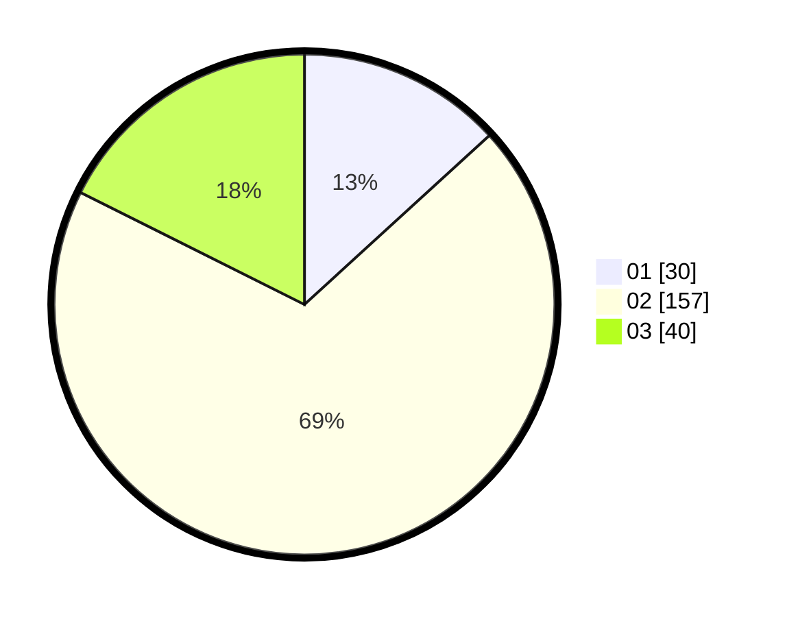

# Hasil

Hasil perolehan suara paslon dapat dilihat pada file paslon-01.txt, paslon-02.txt, dan paslon-03.txt.

Jika tidak ada, artinya data tersebut belum ada pada SIREKAP.

## Perolehan Suara

 * Paslon 01: **30**.
 * Paslon 02: **157**.
 * Paslon 03: **40**.

## Foto C Plano

https://sirekap-obj-formc.kpu.go.id/55fd/pemilu/ppwp/31/73/06/10/03/3173061003174-20240214-223516--82308019-4be3-48ea-9eaf-80b36d76da00.jpg

https://sirekap-obj-formc.kpu.go.id/55fd/pemilu/ppwp/31/73/06/10/03/3173061003174-20240214-230214--bf9beffe-ada2-4468-aaef-b83364120ce2.jpg

https://sirekap-obj-formc.kpu.go.id/55fd/pemilu/ppwp/31/73/06/10/03/3173061003174-20240214-230218--493b99f5-0507-4bcc-b9d9-f3d5be37d189.jpg
