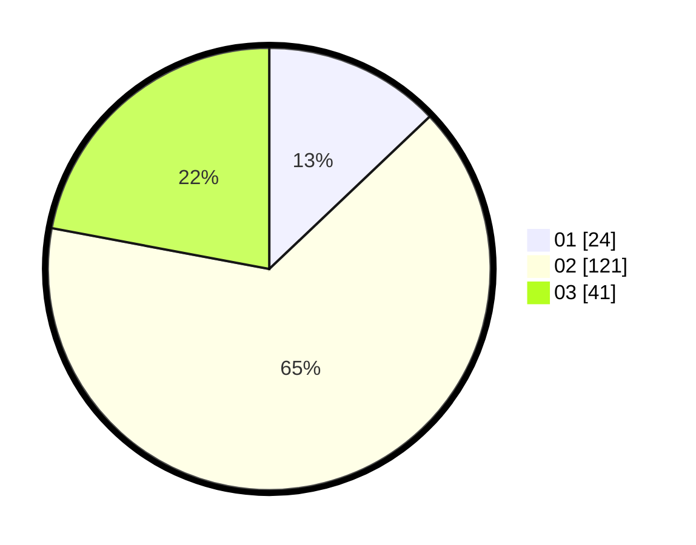

# Hasil

Hasil perolehan suara paslon dapat dilihat pada file paslon-01.txt, paslon-02.txt, dan paslon-03.txt.

Jika tidak ada, artinya data tersebut belum ada pada SIREKAP.

## Perolehan Suara

 * Paslon 01: **24**.
 * Paslon 02: **121**.
 * Paslon 03: **41**.

## Foto C Plano

https://sirekap-obj-formc.kpu.go.id/76ec/pemilu/ppwp/31/73/06/10/03/3173061003175-20240214-213637--d4c4a3ce-dbfb-4021-a55a-a8309bb048c1.jpg

https://sirekap-obj-formc.kpu.go.id/76ec/pemilu/ppwp/31/73/06/10/03/3173061003175-20240214-204600--9de3605f-8135-44de-afa3-c4bc9e123c85.jpg

https://sirekap-obj-formc.kpu.go.id/76ec/pemilu/ppwp/31/73/06/10/03/3173061003175-20240214-204715--3afff632-5606-492e-886c-a98ace210303.jpg

## DATA PEMILIH TETAP

Jumlah pemilih dalam DPT: **256**.
 * L: **130**.
 * P: **126**.

## DATA PENGGUNA HAK PILIH

Jumlah pengguna hak pilih dalam DPT: **188**.
 * L: **91**.
 * P: **97**.

Jumlah pengguna hak pilih dalam DPTb: **0**.
 * L: **0**.
 * P: **0**.

Jumlah pengguna hak pilih dalam DPK: **0**.
 * L: **0**.
 * P: **0**.

Jumlah pengguna hak pilih: **188**.
 * L: **91**.
 * P: **97**.

## JUMLAH SUARA SAH DAN TIDAK SAH

JUMLAH SELURUH SUARA SAH: **186**.

JUMLAH SUARA TIDAK SAH: **2**.

JUMLAH SELURUH SUARA SAH DAN SUARA TIDAK SAH: **188**.
