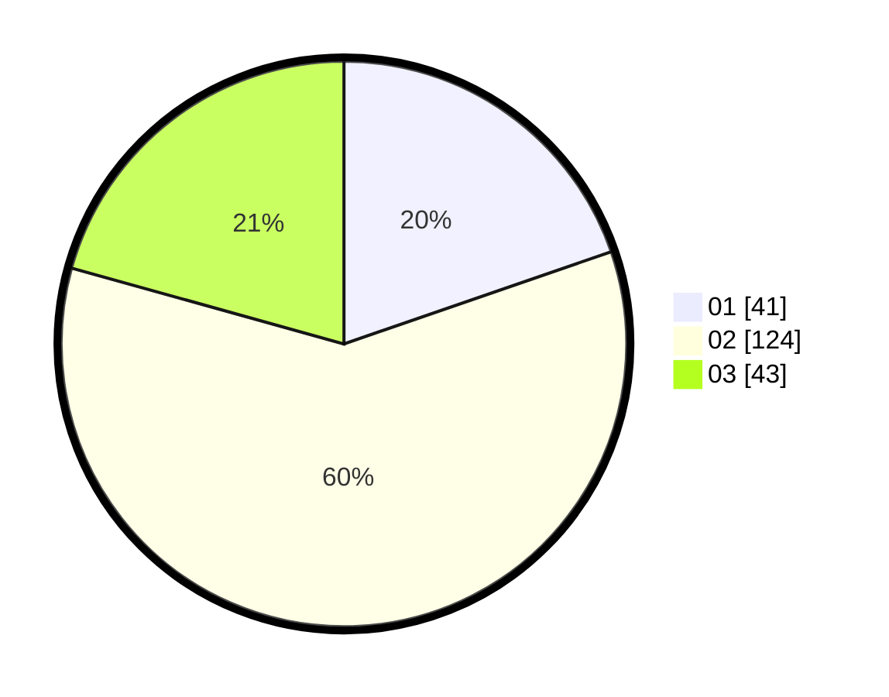

# Hasil

Hasil perolehan suara paslon dapat dilihat pada file paslon-01.txt, paslon-02.txt, dan paslon-03.txt.

Jika tidak ada, artinya data tersebut belum ada pada SIREKAP.

## Perolehan Suara

 * Paslon 01: **41**.
 * Paslon 02: **124**.
 * Paslon 03: **43**.

## Foto C Plano

https://sirekap-obj-formc.kpu.go.id/2b86/pemilu/ppwp/31/73/06/10/03/3173061003177-20240215-023436--8bef52af-e4e8-45b9-871a-b01a712f6897.jpg

https://sirekap-obj-formc.kpu.go.id/2b86/pemilu/ppwp/31/73/06/10/03/3173061003177-20240215-023457--0d84cec7-a4c7-4df0-9795-c57cd0e33e47.jpg

https://sirekap-obj-formc.kpu.go.id/2b86/pemilu/ppwp/31/73/06/10/03/3173061003177-20240215-023446--1bf3f117-17d3-415b-9207-26a559a91863.jpg

## DATA PEMILIH TETAP

Jumlah pemilih dalam DPT: **0**.
 * L: **0**.
 * P: **0**.

## DATA PENGGUNA HAK PILIH

Jumlah pengguna hak pilih dalam DPT: **0**.
 * L: **0**.
 * P: **0**.

Jumlah pengguna hak pilih dalam DPTb: **0**.
 * L: **0**.
 * P: **0**.

Jumlah pengguna hak pilih dalam DPK: **0**.
 * L: **0**.
 * P: **0**.

Jumlah pengguna hak pilih: **0**.
 * L: **0**.
 * P: **0**.

## JUMLAH SUARA SAH DAN TIDAK SAH

JUMLAH SELURUH SUARA SAH: **208**.

JUMLAH SUARA TIDAK SAH: **1**.

JUMLAH SELURUH SUARA SAH DAN SUARA TIDAK SAH: **209**.
