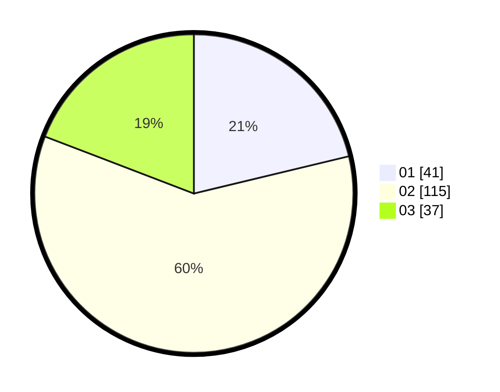

# Hasil

Hasil perolehan suara paslon dapat dilihat pada file paslon-01.txt, paslon-02.txt, dan paslon-03.txt.

Jika tidak ada, artinya data tersebut belum ada pada SIREKAP.

## Perolehan Suara

 * Paslon 01: **41**.
 * Paslon 02: **115**.
 * Paslon 03: **37**.

## Foto C Plano

https://sirekap-obj-formc.kpu.go.id/8778/pemilu/ppwp/31/73/06/10/03/3173061003179-20240216-071530--40a71585-0ef4-4a82-aa40-928e514d933b.jpg

https://sirekap-obj-formc.kpu.go.id/8778/pemilu/ppwp/31/73/06/10/03/3173061003179-20240216-074324--e7e97210-6bca-4c76-a0e2-0e6e5858f20a.jpg

https://sirekap-obj-formc.kpu.go.id/8778/pemilu/ppwp/31/73/06/10/03/3173061003179-20240216-074323--3f15926f-1370-48dc-8c42-1479ac22a475.jpg

## DATA PEMILIH TETAP

Jumlah pemilih dalam DPT: **278**.
 * L: **135**.
 * P: **143**.

## DATA PENGGUNA HAK PILIH

Jumlah pengguna hak pilih dalam DPT: **194**.
 * L: **91**.
 * P: **103**.

Jumlah pengguna hak pilih dalam DPTb: **0**.
 * L: **0**.
 * P: **0**.

Jumlah pengguna hak pilih dalam DPK: **2**.
 * L: **1**.
 * P: **1**.

Jumlah pengguna hak pilih: **196**.
 * L: **92**.
 * P: **104**.

## JUMLAH SUARA SAH DAN TIDAK SAH

JUMLAH SELURUH SUARA SAH: **193**.

JUMLAH SUARA TIDAK SAH: **3**.

JUMLAH SELURUH SUARA SAH DAN SUARA TIDAK SAH: **196**.
