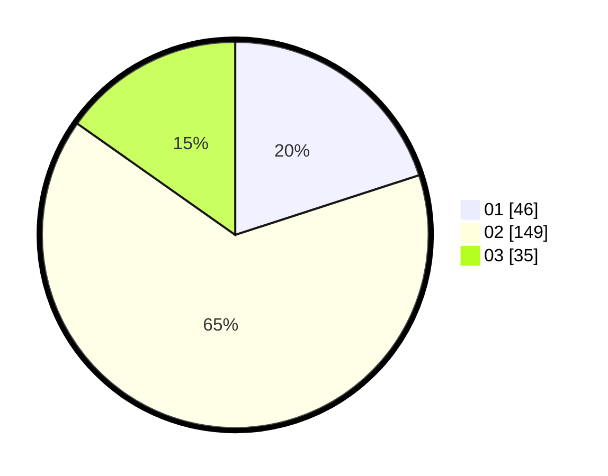

# Hasil

Hasil perolehan suara paslon dapat dilihat pada file paslon-01.txt, paslon-02.txt, dan paslon-03.txt.

Jika tidak ada, artinya data tersebut belum ada pada SIREKAP.

## Perolehan Suara

 * Paslon 01: **46**.
 * Paslon 02: **149**.
 * Paslon 03: **35**.

## Foto C Plano

https://sirekap-obj-formc.kpu.go.id/8ae2/pemilu/ppwp/31/73/06/10/03/3173061003183-20240214-213500--0d5f48ec-51e7-4d84-8ffa-a241ec8d50e0.jpg

https://sirekap-obj-formc.kpu.go.id/8ae2/pemilu/ppwp/31/73/06/10/03/3173061003183-20240214-213723--919c7e4d-179e-4ec4-8141-94ca3873ad6c.jpg

https://sirekap-obj-formc.kpu.go.id/8ae2/pemilu/ppwp/31/73/06/10/03/3173061003183-20240214-213845--ab0e0438-4498-48ea-83b4-937a31fe6e12.jpg
