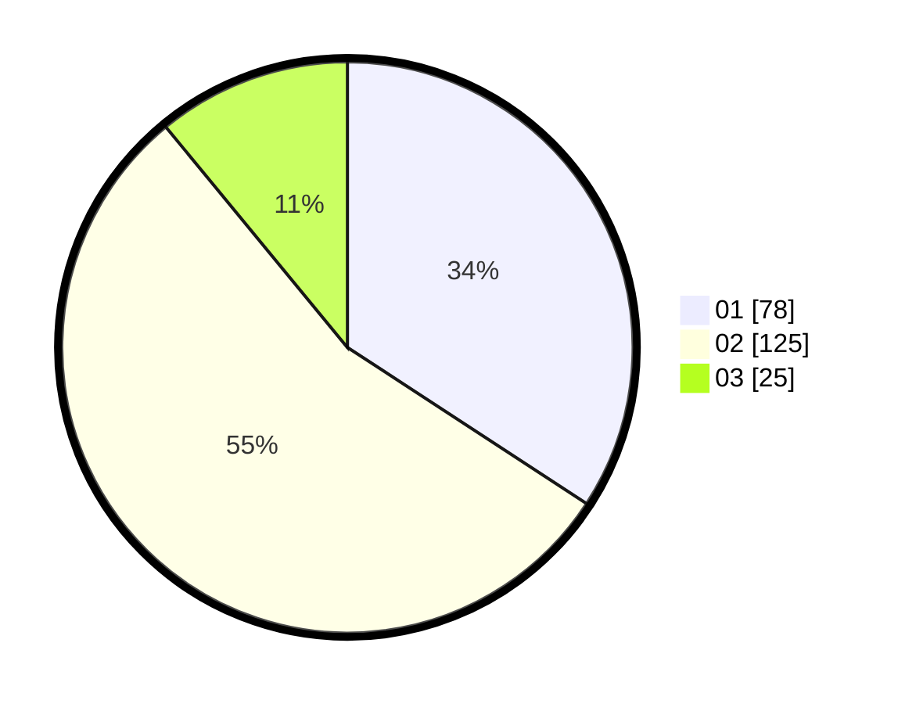

# Hasil

Hasil perolehan suara paslon dapat dilihat pada file paslon-01.txt, paslon-02.txt, dan paslon-03.txt.

Jika tidak ada, artinya data tersebut belum ada pada SIREKAP.

## Perolehan Suara

 * Paslon 01: **78**.
 * Paslon 02: **125**.
 * Paslon 03: **25**.

## Foto C Plano

https://sirekap-obj-formc.kpu.go.id/0f51/pemilu/ppwp/31/73/06/10/03/3173061003184-20240215-222452--0290c0ba-e51f-4efb-ab50-c27562828d98.jpg

https://sirekap-obj-formc.kpu.go.id/0f51/pemilu/ppwp/31/73/06/10/03/3173061003184-20240214-201816--91ba78c5-fef7-4465-b3f9-a17b9272823f.jpg

https://sirekap-obj-formc.kpu.go.id/0f51/pemilu/ppwp/31/73/06/10/03/3173061003184-20240214-201829--55cdf3b3-9fe5-48fb-9c8f-1ead79a3f9a4.jpg

## DATA PEMILIH TETAP

Jumlah pemilih dalam DPT: **0**.
 * L: **0**.
 * P: **0**.

## DATA PENGGUNA HAK PILIH

Jumlah pengguna hak pilih dalam DPT: **0**.
 * L: **0**.
 * P: **0**.

Jumlah pengguna hak pilih dalam DPTb: **0**.
 * L: **0**.
 * P: **0**.

Jumlah pengguna hak pilih dalam DPK: **0**.
 * L: **0**.
 * P: **0**.

Jumlah pengguna hak pilih: **0**.
 * L: **0**.
 * P: **0**.

## JUMLAH SUARA SAH DAN TIDAK SAH

JUMLAH SELURUH SUARA SAH: **228**.

JUMLAH SUARA TIDAK SAH: **5**.

JUMLAH SELURUH SUARA SAH DAN SUARA TIDAK SAH: **233**.
