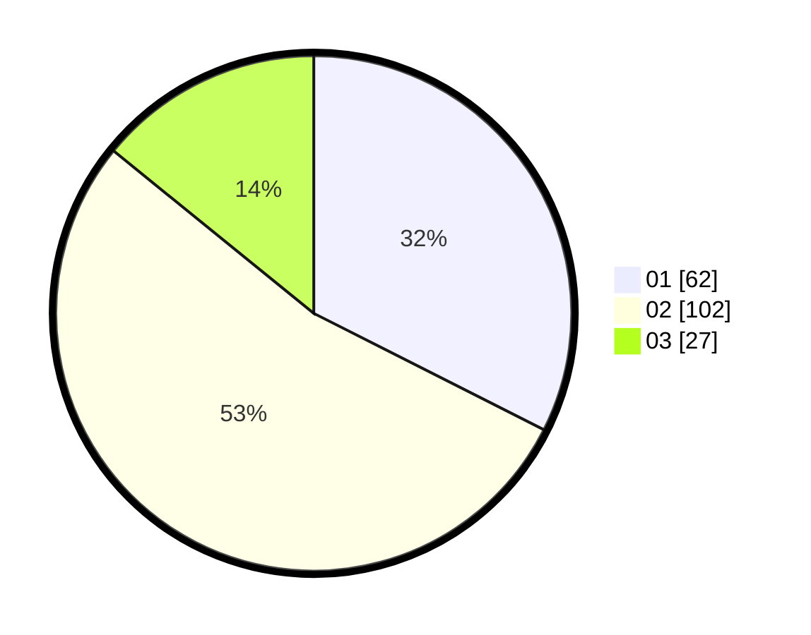

# Hasil

Hasil perolehan suara paslon dapat dilihat pada file paslon-01.txt, paslon-02.txt, dan paslon-03.txt.

Jika tidak ada, artinya data tersebut belum ada pada SIREKAP.

## Perolehan Suara

 * Paslon 01: **62**.
 * Paslon 02: **102**.
 * Paslon 03: **27**.

## Foto C Plano

https://sirekap-obj-formc.kpu.go.id/e085/pemilu/ppwp/31/73/06/10/03/3173061003185-20240214-185706--6852c720-ab34-4241-81c0-558f6bdfe23a.jpg

https://sirekap-obj-formc.kpu.go.id/e085/pemilu/ppwp/31/73/06/10/03/3173061003185-20240214-185807--1eb986f5-7515-4cd6-bf82-ee2d16353ef5.jpg

https://sirekap-obj-formc.kpu.go.id/e085/pemilu/ppwp/31/73/06/10/03/3173061003185-20240214-185946--9d8b6ded-301c-48ce-9a71-7e28d671d874.jpg

## DATA PEMILIH TETAP

Jumlah pemilih dalam DPT: **244**.
 * L: **120**.
 * P: **124**.

## DATA PENGGUNA HAK PILIH

Jumlah pengguna hak pilih dalam DPT: **191**.
 * L: **93**.
 * P: **98**.

Jumlah pengguna hak pilih dalam DPTb: **0**.
 * L: **0**.
 * P: **0**.

Jumlah pengguna hak pilih dalam DPK: **2**.
 * L: **0**.
 * P: **2**.

Jumlah pengguna hak pilih: **193**.
 * L: **93**.
 * P: **100**.

## JUMLAH SUARA SAH DAN TIDAK SAH

JUMLAH SELURUH SUARA SAH: **190**.

JUMLAH SUARA TIDAK SAH: **4**.

JUMLAH SELURUH SUARA SAH DAN SUARA TIDAK SAH: **194**.
