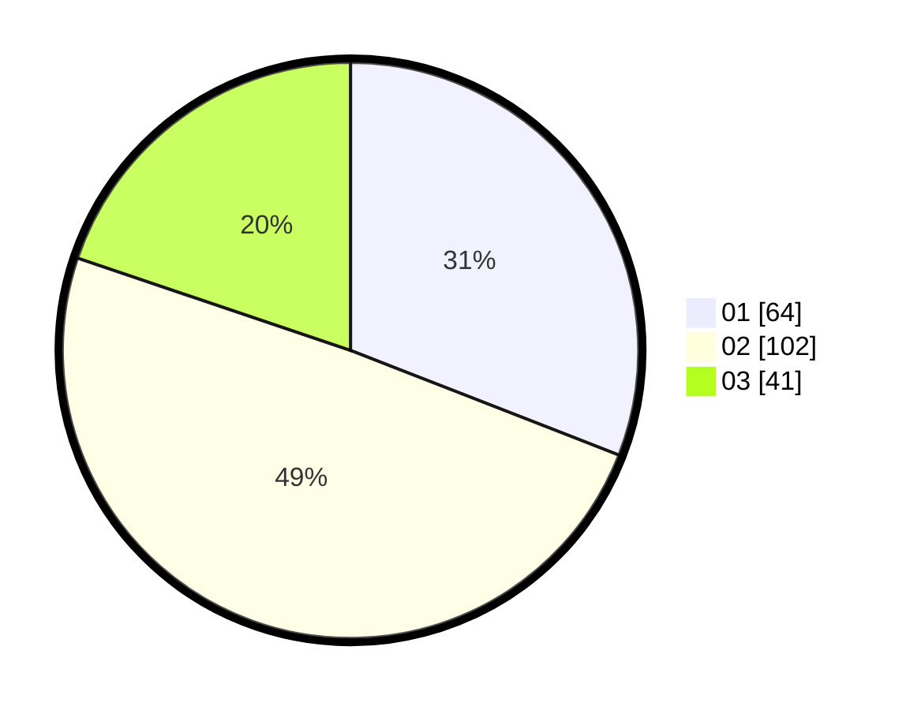

# Hasil

Hasil perolehan suara paslon dapat dilihat pada file paslon-01.txt, paslon-02.txt, dan paslon-03.txt.

Jika tidak ada, artinya data tersebut belum ada pada SIREKAP.

## Perolehan Suara

 * Paslon 01: **64**.
 * Paslon 02: **102**.
 * Paslon 03: **41**.

## Foto C Plano

https://sirekap-obj-formc.kpu.go.id/6079/pemilu/ppwp/31/73/06/10/03/3173061003186-20240214-202108--c8767946-f600-49b3-bbff-ae5c4391f69b.jpg

https://sirekap-obj-formc.kpu.go.id/6079/pemilu/ppwp/31/73/06/10/03/3173061003186-20240214-215116--c5081286-bbe2-4e51-88ee-e0f214c554a2.jpg
