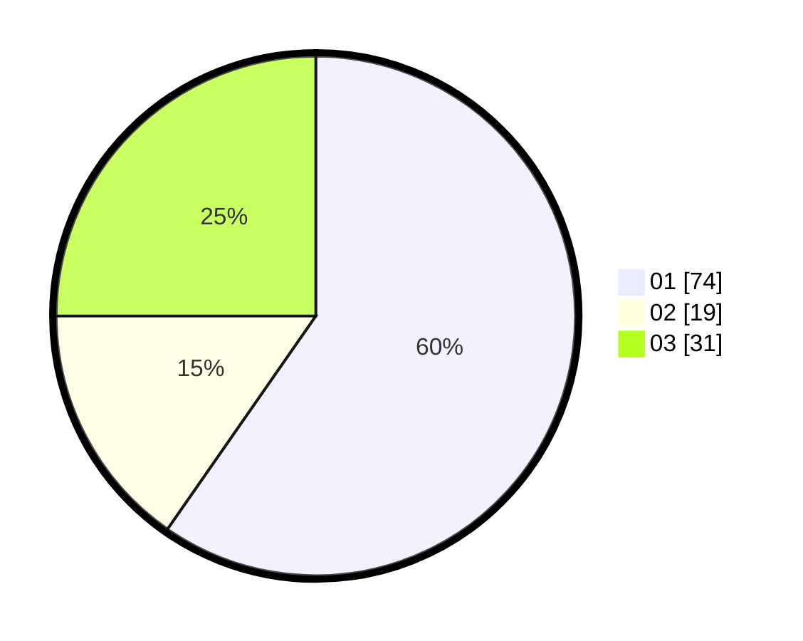

# Hasil

Hasil perolehan suara paslon dapat dilihat pada file paslon-01.txt, paslon-02.txt, dan paslon-03.txt.

Jika tidak ada, artinya data tersebut belum ada pada SIREKAP.

## Perolehan Suara

 * Paslon 01: **74**.
 * Paslon 02: **19**.
 * Paslon 03: **31**.

## Foto C Plano

https://sirekap-obj-formc.kpu.go.id/79df/pemilu/ppwp/31/73/06/10/03/3173061003194-20240214-222608--01d1b214-e81b-4afa-b7c8-7b07dba3afe6.jpg

https://sirekap-obj-formc.kpu.go.id/79df/pemilu/ppwp/31/73/06/10/03/3173061003194-20240214-223254--1dc4cea7-6c3d-42bb-9526-be97ffddcfea.jpg

https://sirekap-obj-formc.kpu.go.id/79df/pemilu/ppwp/31/73/06/10/03/3173061003194-20240214-222845--0b3d8401-d2a0-4c59-80ca-03c82d08e00d.jpg
