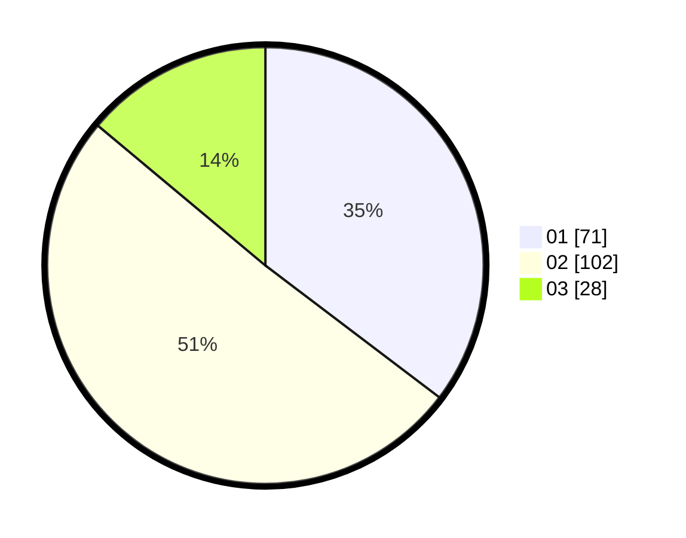

# Hasil

Hasil perolehan suara paslon dapat dilihat pada file paslon-01.txt, paslon-02.txt, dan paslon-03.txt.

Jika tidak ada, artinya data tersebut belum ada pada SIREKAP.

## Perolehan Suara

 * Paslon 01: **71**.
 * Paslon 02: **102**.
 * Paslon 03: **28**.

## Foto C Plano

https://sirekap-obj-formc.kpu.go.id/0b8b/pemilu/ppwp/31/73/06/10/03/3173061003197-20240214-235752--8aa755ee-e58a-4e69-8851-733dd5abd1e0.jpg

https://sirekap-obj-formc.kpu.go.id/0b8b/pemilu/ppwp/31/73/06/10/03/3173061003197-20240215-000032--4d277675-0ca1-48fe-b080-d8f2f35f0344.jpg

https://sirekap-obj-formc.kpu.go.id/0b8b/pemilu/ppwp/31/73/06/10/03/3173061003197-20240215-000317--8b19c582-6c8a-4ead-ad60-1af6364e69b0.jpg
