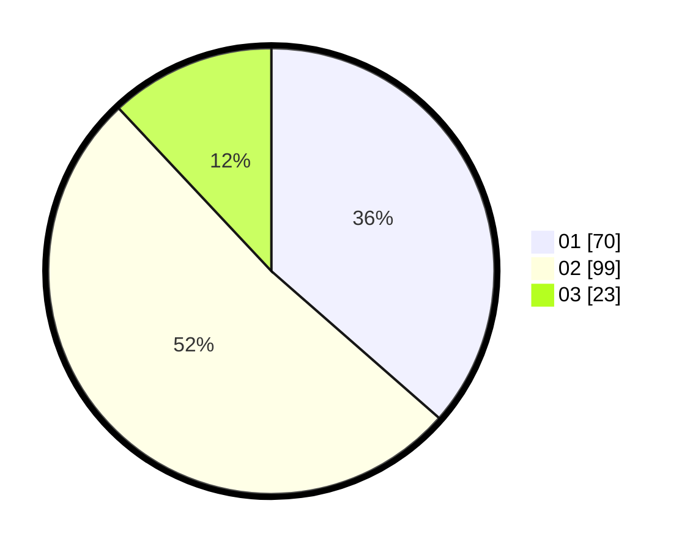

# Hasil

Hasil perolehan suara paslon dapat dilihat pada file paslon-01.txt, paslon-02.txt, dan paslon-03.txt.

Jika tidak ada, artinya data tersebut belum ada pada SIREKAP.

## Perolehan Suara

 * Paslon 01: **70**.
 * Paslon 02: **99**.
 * Paslon 03: **23**.

## Foto C Plano

https://sirekap-obj-formc.kpu.go.id/15f1/pemilu/ppwp/31/73/06/10/03/3173061003199-20240214-214411--7bb07fb7-f936-4d99-b3f2-e724d937ac4d.jpg

https://sirekap-obj-formc.kpu.go.id/15f1/pemilu/ppwp/31/73/06/10/03/3173061003199-20240214-214438--22a63ec1-ad04-4471-bd5a-8f191b987898.jpg

https://sirekap-obj-formc.kpu.go.id/15f1/pemilu/ppwp/31/73/06/10/03/3173061003199-20240214-214502--92171f6d-2b40-45cb-9d15-fa68d3ea42c5.jpg
